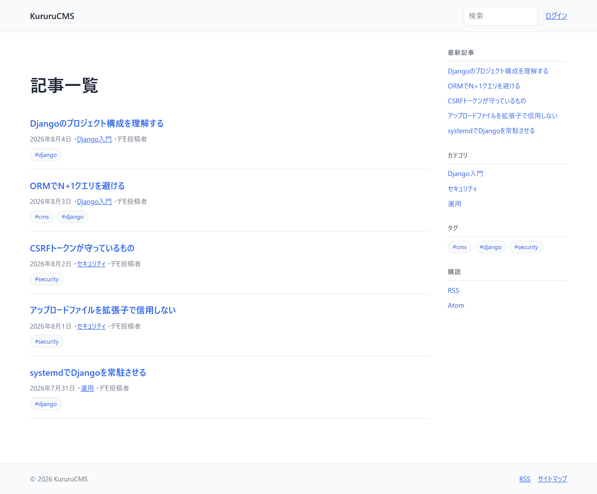

# 【3日目】Django CRUD 完全入門――記事一覧から投稿・編集・削除まで作る

> 連載「10日で作る Django CMS」の3日目です。
> 成果物: <https://github.com/kurumonn/DjangoCMS>（タグ `day-03`）

---

## 1. 今日の結論

2日目に作ったモデルを、画面につなぎます。

- 記事一覧（ページネーション付き）
- 記事詳細
- 記事の投稿・編集・削除
- ログイン必須化
- **自分の記事だけ編集できる** 権限
- **未公開記事は 404 で隠す**（403 にしない）

**今日いちばん大事なのは、「見えてはいけないものが見えないこと」を先に固めること**です。
機能を足すのは後からでもできますが、漏れは一度公開すると取り返せません。

---

## 2. 今日の完成画面

記事一覧はこうなります。



サイドバーやタグは6日目に追加したものです。3日目の時点ではもっと素朴です。

処理の流れはこうです。

```text
GET /
   ↓
config/urls.py       →  blog/urls.py
   ↓
ArticleListView
   ↓
Article.objects.published().with_related()
   ↓
templates/blog/article_list.html
   ↓
HTML レスポンス
```

---

## 3. 今日変更するファイル

```text
blog/
├── views.py          新規（5つのビュー）
├── forms.py          新規
├── urls.py           変更
└── tests/
    ├── test_views.py   新規
    └── factories.py    変更（権限つきユーザーを作る）
pages/
├── views.py          新規
└── urls.py           新規
templates/
├── base.html                     変更（ログイン・ログアウト）
└── blog/
    ├── article_list.html         新規
    ├── article_detail.html       新規
    ├── article_form.html         新規
    └── article_confirm_delete.html  新規
config/
└── urls.py           変更（django.contrib.auth.urls を追加）
static/css/site.css   変更
```

---

## 4. 完成コード

### 4.1 記事一覧

```python
# blog/views.py（抜粋）
from django.views.generic import ListView

from .models import Article


class ArticleListView(ListView):
    """公開済み記事の一覧。"""

    model = Article
    template_name = "blog/article_list.html"
    context_object_name = "articles"
    paginate_by = 10

    def get_queryset(self):
        # published() を通さないと、下書きや予約投稿が一般利用者へ漏れる。
        return Article.objects.published().with_related()
```

### 4.2 記事詳細（未公開記事の扱いが要点）

```python
from django.http import Http404
from django.views.generic import DetailView


class ArticleDetailView(DetailView):
    """記事詳細。

    未公開記事は、著者本人とスタッフだけが確認できる（プレビュー）。
    それ以外には 404 を返す。403 を返すと「その slug の記事は存在する」
    という情報が漏れるため、存在自体を隠す。
    """

    model = Article
    template_name = "blog/article_detail.html"
    context_object_name = "article"

    def get_queryset(self):
        return Article.objects.all().with_related()

    def get_object(self, queryset=None):
        article = super().get_object(queryset)
        if article.is_visible_to_public:
            return article

        user = self.request.user
        if user.is_authenticated and (user == article.author or user.is_staff):
            return article

        raise Http404("記事が見つかりません。")

    def get_context_data(self, **kwargs):
        context = super().get_context_data(**kwargs)
        article = context["article"]
        context["is_preview"] = not article.is_visible_to_public
        context["can_edit"] = _can_edit(self.request.user, article)
        return context
```

### 4.3 権限判定

```python
def _can_edit(user, article: Article) -> bool:
    """記事を編集・削除してよいか。

    判定をここ1か所にまとめる。View・テンプレート・API で
    別々の条件を書くと、片方だけ直し忘れて権限が抜ける。
    """
    if not user.is_authenticated:
        return False
    if user.is_staff:
        return True
    return article.author_id == user.pk


class ArticleOwnerMixin:
    """自分の記事か、スタッフ権限があるときだけ通す。"""

    def get_object(self, queryset=None):
        article = super().get_object(queryset)
        if not _can_edit(self.request.user, article):
            raise PermissionDenied("この記事を編集する権限がありません。")
        return article
```

> **9日目で1か所直します。**
> この `_can_edit()` は `is_staff` しか見ていないため、
> 「編集者」ロール（`is_staff` を持たない）が他人の記事を編集できません。
> 9日目にスクリーンショットを撮ろうとして気づきました。
> 詳しくは [`docs/errors/day-09.md`](../errors/day-09.md) を参照してください。

### 4.4 投稿・編集・削除

```python
from django.contrib import messages
from django.contrib.auth.mixins import LoginRequiredMixin, PermissionRequiredMixin
from django.urls import reverse_lazy
from django.views.generic import CreateView, DeleteView, UpdateView

from .forms import ArticleForm


class ArticleCreateView(LoginRequiredMixin, PermissionRequiredMixin, CreateView):
    model = Article
    form_class = ArticleForm
    template_name = "blog/article_form.html"
    permission_required = "blog.add_article"

    def form_valid(self, form):
        # 著者はフォームの値ではなく、ログイン中のユーザーで決める。
        form.instance.author = self.request.user
        response = super().form_valid(form)
        messages.success(self.request, "記事を作成しました。")
        return response


class ArticleUpdateView(
    LoginRequiredMixin, PermissionRequiredMixin, ArticleOwnerMixin, UpdateView
):
    model = Article
    form_class = ArticleForm
    template_name = "blog/article_form.html"
    permission_required = "blog.change_article"


class ArticleDeleteView(
    LoginRequiredMixin, PermissionRequiredMixin, ArticleOwnerMixin, DeleteView
):
    model = Article
    template_name = "blog/article_confirm_delete.html"
    permission_required = "blog.delete_article"
    success_url = reverse_lazy("blog:article_list")
```

### 4.5 フォーム

```python
# blog/forms.py
from django import forms
from django.utils import timezone

from .models import Article


class ArticleForm(forms.ModelForm):
    """記事の投稿・編集フォーム。

    author はフォームに含めない。画面から送られてきた値で著者を決めると、
    他人の名前で記事を投稿できてしまうため、View 側で request.user を入れる。
    """

    class Meta:
        model = Article
        fields = ["title", "body", "category", "tags", "status", "published_at"]
        widgets = {
            "body": forms.Textarea(attrs={"rows": 18}),
            "published_at": forms.DateTimeInput(
                attrs={"type": "datetime-local"}, format="%Y-%m-%dT%H:%M"
            ),
            "tags": forms.CheckboxSelectMultiple(),
        }

    def clean(self):
        cleaned = super().clean()
        status = cleaned.get("status")
        published_at = cleaned.get("published_at")

        # 「公開」にしたのに公開日時が無い場合は、現在時刻を補う。
        # 空のままだと published() の条件に一致せず、
        # 「公開したはずなのに一覧に出ない」という分かりにくい状態になる。
        if status == Article.Status.PUBLISHED and not published_at:
            cleaned["published_at"] = timezone.now()

        return cleaned
```

### 4.6 URL

```python
# blog/urls.py
from django.urls import path

from . import views

app_name = "blog"

urlpatterns = [
    path("", views.ArticleListView.as_view(), name="article_list"),
    # "articles/new/" を "articles/<slug>/" より先に置く。
    # 逆にすると "new" がスラッグとして解釈される。
    path("articles/new/", views.ArticleCreateView.as_view(), name="article_create"),
    path("articles/<slug:slug>/", views.ArticleDetailView.as_view(), name="article_detail"),
    path("articles/<slug:slug>/edit/", views.ArticleUpdateView.as_view(), name="article_update"),
    path("articles/<slug:slug>/delete/", views.ArticleDeleteView.as_view(), name="article_delete"),
    path("categories/<slug:slug>/", views.CategoryArticleListView.as_view(), name="category_detail"),
    path("tags/<slug:slug>/", views.TagArticleListView.as_view(), name="tag_detail"),
]
```

### 4.7 テンプレート（本文の出し方が要点）

```django
{# templates/blog/article_detail.html（抜粋） #}

{# linebreaks は HTML をエスケープしたうえで改行を <p>/<br> に変換する。 #}
{# ここで |safe を使うと投稿者が自由に <script> を仕込めるようになる。 #}
<div class="article__body">{{ article.body|linebreaks }}</div>
```

---

## 5. コードの意味

### 汎用ビューの対応表

| クラス | HTTP | 役割 |
| --- | --- | --- |
| `ListView` | GET | 複数件を一覧表示する |
| `DetailView` | GET | 1件を表示する |
| `CreateView` | GET/POST | フォーム表示と作成 |
| `UpdateView` | GET/POST | フォーム表示と更新 |
| `DeleteView` | GET/POST | 確認画面と削除 |

`DeleteView` の GET は **確認画面を出すだけ** で、削除は実行しません。
削除は POST でのみ実行されます。
GET で削除できると、外部サイトの `` を踏ませるだけで
記事を消せてしまいます。

### `ListView` の設定

```python
class ArticleListView(ListView):
    model = Article
    template_name = "blog/article_list.html"
    context_object_name = "articles"
    paginate_by = 10
```

| コード | 意味 |
| --- | --- |
| `model` | 対象のモデル |
| `template_name` | 使うテンプレート（省略すると `blog/article_list.html` が既定） |
| `context_object_name` | テンプレートでの変数名（既定は `object_list`） |
| `paginate_by` | 1ページの件数。指定すると `page_obj` が使えるようになる |
| `get_queryset()` | どのデータを取るかを決める |

### `select_related` と `prefetch_related`

```python
def with_related(self):
    return self.select_related("author", "category").prefetch_related("tags")
```

| メソッド | 対象 | やり方 |
| --- | --- | --- |
| `select_related` | `ForeignKey`（多対一） | SQL の JOIN で1回にまとめる |
| `prefetch_related` | `ManyToManyField`（多対多） | 追加で1回だけ問い合わせ、Python 側で結合する |

これを付けないと、記事10件の一覧でこうなります。

```text
1回目  記事10件を取得
2回目  1件目の著者を取得
3回目  1件目のカテゴリを取得
4回目  2件目の著者を取得
...
```

記事が増えるほどクエリが増えます。これを **N+1 問題** と呼びます。

### `LoginRequiredMixin` と `PermissionRequiredMixin`

| Mixin | 動き | 未満足時 |
| --- | --- | --- |
| `LoginRequiredMixin` | ログインしているか | ログイン画面へリダイレクト（302） |
| `PermissionRequiredMixin` | 指定の権限を持つか | 403 |

**継承の順番が重要です。** 左に書いたものが先に評価されます。

```python
class ArticleUpdateView(
    LoginRequiredMixin,      # 1. ログインしているか
    PermissionRequiredMixin, # 2. 権限を持つか
    ArticleOwnerMixin,       # 3. 自分の記事か
    UpdateView,
):
```

`LoginRequiredMixin` を後ろに置くと、
未ログインの利用者に 403 を返してしまい、ログイン画面へ案内できません。

### `|linebreaks` と `|safe`

```django
{{ article.body|linebreaks }}   {# 安全 #}
{{ article.body|safe }}         {# 危険 #}
```

| フィルタ | 動き |
| --- | --- |
| `linebreaks` | **エスケープしてから** 改行を `<p>` `<br>` に変換する |
| `safe` | エスケープを止める。HTML がそのまま出力される |

投稿者が本文に `<script>alert(1)</script>` と書いた場合:

- `linebreaks` → `&lt;script&gt;alert(1)&lt;/script&gt;`（文字として表示）
- `safe` → **スクリプトとして実行される**

`|safe` は「自分が書いた HTML を出す」ときだけ使い、
**利用者が入力した値には絶対に使いません**。

---

## 6. 内部で起きていること

### リクエストが処理される順番

```text
ブラウザー
   ↓ GET /articles/hello/
Django のミドルウェア（セッション・認証・CSRF …）
   ↓
config/urls.py で照合
   ↓
blog/urls.py で照合 → article_detail に一致
   ↓
ArticleDetailView.as_view()(request, slug="hello")
   ↓
get_queryset()  … どのデータを対象にするか
   ↓
get_object()    … 1件を特定する（ここで 404 判定）
   ↓
get_context_data()  … テンプレートへ渡す値を作る
   ↓
render()  … テンプレートを HTML にする
   ↓
HttpResponse
```

### URL パターンの照合順

```python
path("articles/new/", ArticleCreateView, ...)          # 先
path("articles/<slug:slug>/", ArticleDetailView, ...)  # 後
```

Django は **上から順に** 照合し、最初に一致したもので止まります。

順番を逆にすると、`/articles/new/` が
「スラッグが `new` の記事」として解釈され、404 になります。
**具体的なパスを、変数を含むパスより先に置きます。**

### なぜ 403 ではなく 404 なのか

未公開記事を第三者が開いたとき、この CMS は 404 を返します。

```python
raise Http404("記事が見つかりません。")
```

403（権限がない）を返すと、こういう情報が漏れます。

```text
GET /articles/new-product-launch/  → 403
   「new-product-launch という記事が存在する」と分かる
```

未発表の企画名や、社内用の記事タイトルを
URL の総当たりで推測されるのを防ぐため、**存在自体を隠します**。

---

## 7. コマンドの説明

### `python manage.py test blog`

| 項目 | 内容 |
| --- | --- |
| 目的 | `blog` アプリのテストを実行する |
| 実行場所 | `manage.py` があるディレクトリ |
| 正常例 | `Ran 40 tests in 4.673s` `OK` |
| 異常例 | `FAILED (failures=1)` |
| 判断方法 | 最終行が `OK` |

テスト用のデータベースは毎回作り直されるので、
開発用のデータは壊れません。

### `python manage.py show_urls`（django-extensions が必要）

標準にはありません。素の Django で URL 一覧を見るには次を使います。

```bash
python manage.py shell -c "from django.urls import get_resolver; print('\n'.join(sorted(get_resolver().reverse_dict.keys(), key=str)))"
```

「URL 名を書いたのに `NoReverseMatch` になる」ときに役立ちます。

---

## 8. よくあるエラー

### 8.1 `NoReverseMatch: Reverse for 'article_detail' with arguments '()' not found`

**原因**: `` のように、必要な引数を渡していません。

```django
{# 誤り #}
<a href="">

{# 正しい #}
<a href="">

{# もっと良い（モデルに任せる） #}
<a href="{{ article.get_absolute_url }}">
```

3つ目が一番安全です。URL の形が変わっても、
`get_absolute_url()` を直すだけで全テンプレートに反映されます。

### 8.2 `/articles/new/` が 404 になる

**原因**: URL の並び順です。「6. 内部で起きていること」を参照してください。

### 8.3 削除ボタンを押しても消えない

**原因**: `DeleteView` の GET は確認画面を出すだけです。
確認画面の「削除」ボタンが `<form method="post">` になっているか確かめてください。

```django
<form method="post">
  
  <button type="submit" class="btn btn--danger">削除する</button>
</form>
```

### 8.4 「公開にしたのに一覧へ出ない」

**原因**: `published_at` が空のままです。

`published()` は `published_at__isnull=False` を条件にしているため、
状態を「公開」にしても日時が入っていなければ一覧に出ません。

この CMS では、フォーム側で補っています。

```python
if status == Article.Status.PUBLISHED and not published_at:
    cleaned["published_at"] = timezone.now()
```

---

## 9. 動作確認

- [ ] トップページに公開記事だけが並ぶ
- [ ] 記事が0件でもエラーにならず、「まだ公開された記事がありません」と出る
- [ ] 記事を11件作ると、1ページ目に10件・2ページ目に1件表示される
- [ ] 下書き記事の URL を直接開くと、ログアウト状態では **404**
- [ ] 同じ URL を著者本人が開くと 200 で、プレビューの注意書きが出る
- [ ] ログインせずに `/articles/new/` を開くと、ログイン画面へリダイレクトされる
- [ ] 権限のないユーザーが `/articles/new/` を開くと 403
- [ ] 他人の記事の編集画面を開くと 403
- [ ] 削除ページを GET しても記事は消えない
- [ ] 本文に `<script>alert(1)</script>` と書いても、文字として表示される

最後の項目は必ず自分で試してください。
`|safe` を付けてしまっていると、ここでアラートが出ます。

---

## 10. セキュリティ上の注意

### 著者はフォームの値で決めない

```python
def form_valid(self, form):
    # 著者はフォームの値ではなく、ログイン中のユーザーで決める。
    form.instance.author = self.request.user
    return super().form_valid(form)
```

`ArticleForm` の `fields` に `author` を含めると、
POST に `author=1` を混ぜるだけで他人の名前で記事を投稿できます。

画面にその欄が無くても関係ありません。**POST は画面を経由せずに送れます。**

テストで固定しておきます。

```python
def test_author_cannot_be_spoofed(self):
    victim = create_user(username="victim")
    create_author(username="attacker")
    self.client.login(username="attacker", password=PASSWORD)
    self.client.post(self.url, self._payload(author=victim.pk))

    article = Article.objects.get(title="新しい記事")
    self.assertEqual(article.author.username, "attacker")
```

### 権限判定を1か所にまとめる

```python
def _can_edit(user, article) -> bool:
    ...
```

View・テンプレート・API がそれぞれ別の条件を書くと、
片方だけ直し忘れて権限が抜けます。

実際、この CMS では7日目に自動保存 API を作ったとき、
API 側に別の条件を書いてしまい、9日目に食い違いが表面化しました。
（[`docs/errors/day-09.md`](../errors/day-09.md) の5番）

### 状態を変える操作は POST のみ

| 操作 | メソッド | 理由 |
| --- | --- | --- |
| 一覧・詳細・検索 | GET | 状態を変えない。ブックマークできてよい |
| 投稿・編集・削除 | POST | 状態を変える。CSRF トークンで保護する |
| ログアウト | POST | GET だと外部サイトから強制ログアウトさせられる |

Django 5 では `LogoutView` が GET を受け付けなくなりました。
テンプレートもフォームにします。

```django
<form method="post" action="" class="inline-form">
  
  <button type="submit" class="btn btn--link">ログアウト</button>
</form>
```

### CSRF トークンを外さない

```django
<form method="post">
     {# これが無いと 403 になる #}
  ...
</form>
```

「403 が出るから」という理由で `@csrf_exempt` を付けるのは、
鍵が開かないので鍵を外すのと同じです。原因を直してください。

---

## 11. 今日の復習問題

**問1.** 未公開記事に対して 403 ではなく 404 を返すのはなぜですか。

**問2.** `select_related` と `prefetch_related` の違いを、
対象になるフィールドの種類とともに説明してください。

**問3.** 次のコードの問題点を指摘してください。

```python
class ArticleForm(forms.ModelForm):
    class Meta:
        model = Article
        fields = ["title", "body", "author", "category", "status"]
```

**問4.** `{{ article.body|safe }}` と書くと何が起きますか。

**問5.** URL パターンで `articles/new/` を `articles/<slug:slug>/` より先に書くのはなぜですか。

<details>
<summary>解答</summary>

**問1.**
403 は「権限が無い」という意味なので、そのリソースが存在することを伝えてしまいます。
未発表の企画名などが URL に含まれる場合、
総当たりで「どの記事が存在するか」を調べられます。
404 を返して存在自体を隠します。

**問2.**
`select_related` は `ForeignKey`（多対一）が対象で、SQL の JOIN によって
1回のクエリでまとめて取得します。
`prefetch_related` は `ManyToManyField`（多対多）が対象で、
別途1回のクエリを発行し、Python 側で結び付けます。
どちらも N+1 問題を防ぐためのものです。

**問3.**
`author` をフォームの `fields` に含めています。
POST に他人のユーザー ID を混ぜるだけで、他人の名前で記事を投稿できます。
著者は View 側で `form.instance.author = self.request.user` として決めます。

**問4.**
本文の HTML エスケープが無効になり、投稿された内容が
そのまま HTML として解釈されます。
`<script>` を書き込まれると、閲覧者のブラウザーで実行されます（XSS）。

**問5.**
Django は URL パターンを上から順に照合し、最初に一致したもので止めます。
`articles/<slug:slug>/` を先に書くと、`new` がスラッグとして解釈され、
「スラッグが new の記事」を探して 404 になります。

</details>

---

## 12. Git の差分

```text
タグ    : day-03
コミット: day-03: 記事の一覧・詳細・投稿・編集・削除と権限を作る
```

```bash
git diff day-02 day-03
```

```bash
git checkout day-03
```

テストは40件になりました。

```bash
python manage.py test blog
```

---

## 13. 次回予告

4日目は、CMS を実用に近づけます。

- アイキャッチ画像とメディアライブラリ
- **アップロードファイルを拡張子で信用しない**検証
- コメント投稿と承認制
- サイト内検索
- 関連記事

特にアップロード検証は、CMS でもっとも攻撃されやすい入口です。
「`.jpg` だから画像」という判断が成立しない理由を、実際に試しながら見ていきます。

次回 → [【4日目】Django CMS を実用化](day-04.md)
