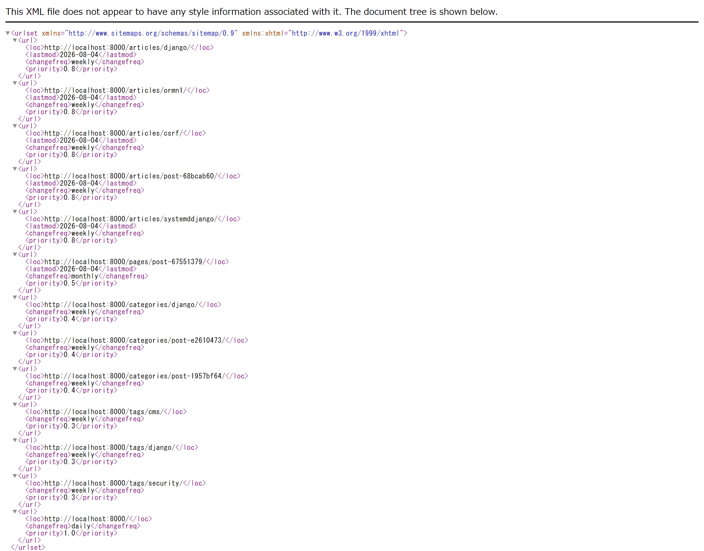

# 【6日目】Django CMS の SEO 対策――OGP・構造化データ・RSS・サイトマップ

> 連載「10日で作る Django CMS」の6日目です。
> 成果物: <https://github.com/kurumonn/DjangoCMS>（タグ `day-06`）

---

## 1. 今日の結論

公開サイトとしての体裁を整えます。

- SEO タイトル・説明文・canonical URL・noindex
- OGP と X（Twitter）カード
- 構造化データ（JSON-LD）
- XML サイトマップと RSS / Atom
- `robots.txt`
- パンくずリスト
- サイト設定（サイト名・色・サイドバー）

**今日いちばん大事なのは、絶対URLの出所を1つに決めること**です。
これを怠ると、サイトマップと canonical URL が別のドメインを指します。
**この不具合は、テストが全部通っている状態で起きました。**

---

## 2. 今日の完成画面

XML サイトマップが出力されます。



サイドバーとパンくずリストも追加されます。

```text
┌──────────────────────────────┬──────────────┐
│ ホーム › セキュリティ › 記事  │ 最新記事      │
│                              │ カテゴリ      │
│ 記事タイトル                  │ タグ          │
│ 本文…                        │ 購読(RSS)     │
└──────────────────────────────┴──────────────┘
```

---

## 3. 今日変更するファイル

```text
seo/                        新規アプリ
├── models.py               SiteSetting（サイト設定）
├── sitemaps.py             XML サイトマップ
├── feeds.py                RSS / Atom
├── views.py                robots.txt
├── urls.py
├── admin.py
├── context_processors.py   全テンプレートへ設定を渡す
├── templatetags/
│   └── seo_tags.py         JSON-LD の生成
└── tests.py
blog/
├── models.py               変更（SEO フィールド）
├── forms.py                変更
└── admin.py                変更
templates/
├── base.html               変更（meta / OGP / サイドバー）
├── blog/article_detail.html  変更
└── partials/
    ├── breadcrumb.html     新規
    └── sidebar.html        新規
config/settings.py          変更（sitemaps / context_processors）
config/urls.py              変更
```

---

## 4. 完成コード

### 4.1 サイト設定（シングルトン）

```python
# seo/models.py（抜粋）
from urllib.parse import urlsplit

from django.conf import settings
from django.core.validators import RegexValidator
from django.db import models

# CSS へ差し込む色は自由入力にしない。
# 任意の文字列を CSS に埋め込めると、そこから CSS インジェクションが成立する。
HEX_COLOR = RegexValidator(
    r"^#(?:[0-9a-fA-F]{3}|[0-9a-fA-F]{6})$",
    "色は #rgb または #rrggbb の形式で指定してください。",
)


class SiteSetting(models.Model):
    """サイト全体の設定。行は常に1つだけ持つ（シングルトン）。"""

    site_name = models.CharField("サイト名", max_length=100, default="KururuCMS")
    description = models.CharField("サイト説明", max_length=160, blank=True, default="")

    # 絶対URLの組み立てに使う。
    # RSS・サイトマップ・OGP は相対URLでは正しく動かない。
    base_url = models.URLField(
        "サイトのURL",
        default="http://localhost:8000",
        help_text="末尾のスラッシュなし。例: https://cms.example.com",
    )

    accent_color = models.CharField(
        "アクセント色", max_length=7, default="#2563eb", validators=[HEX_COLOR]
    )

    # 検索エンジンにサイト全体をインデックスさせない（ステージング用）。
    noindex_site = models.BooleanField("サイト全体を検索エンジンから除外", default=False)

    def save(self, *args, **kwargs):
        # 常に pk=1 に固定する。行が増えると「どれが本物か」が分からなくなる。
        self.pk = 1
        # URL の末尾スラッシュを落として、二重スラッシュを防ぐ。
        self.base_url = (self.base_url or "").rstrip("/")
        super().save(*args, **kwargs)
        self._sync_django_site()

    @classmethod
    def load(cls) -> "SiteSetting":
        """設定を取得する。無ければ既定値で作る。"""
        obj, _ = cls.objects.get_or_create(pk=1)
        return obj

    def absolute_url(self, path: str) -> str:
        """相対パスをサイトの絶対URLへ変換する。"""
        if not path:
            return self.base_url
        if path.startswith(("http://", "https://")):
            return path
        return f"{self.base_url}/{path.lstrip('/')}"
```

### 4.2 記事の SEO フィールド

```python
# blog/models.py（抜粋）
    # 記事タイトルと検索結果のタイトルは、目的が違うので分けられるようにする。
    # 記事内では「ORMでN+1クエリを避ける」で十分でも、
    # 検索結果では「Django ORMのN+1問題を解決する方法」の方がクリックされる。
    seo_title = models.CharField("SEOタイトル", max_length=70, blank=True, default="")
    seo_description = models.CharField("SEO説明文", max_length=160, blank=True, default="")
    canonical_url = models.URLField("正規URL", blank=True, default="")
    noindex = models.BooleanField("検索エンジンから除外", default=False)
    og_image = models.ForeignKey(
        "media_library.MediaAsset", on_delete=models.SET_NULL,
        null=True, blank=True, related_name="og_articles",
    )
```

```python
    # テンプレート内で  を重ねるのではなく、
    # 「最終的に何を出すか」をモデル側で決める。
    # 出力箇所（詳細ページ・OGP・RSS・サイトマップ）が増えても矛盾しない。
    @property
    def display_seo_title(self) -> str:
        return self.seo_title or self.title

    @property
    def display_seo_description(self) -> str:
        if self.seo_description:
            return self.seo_description
        flattened = " ".join(self.body.split())
        return flattened[:157] + "…" if len(flattened) > 160 else flattened

    @property
    def display_og_image(self):
        """OG画像 → アイキャッチ → なし、の順で解決する。"""
        return self.og_image or self.featured_image
```

### 4.3 構造化データ（JSON-LD）

**テンプレートに手書きしません。** 理由はコード内のコメントに書いています。

```python
# seo/templatetags/seo_tags.py
"""SEO 用のテンプレートタグ。

構造化データ（JSON-LD）は、テンプレートに手書きしない。

理由:

  * タイトルや説明文に </script> という文字列が入っただけで、
    ブラウザがそこをスクリプトの終わりと解釈し、以降の HTML が壊れる。
  * 引用符・改行・バックスラッシュのエスケープを手作業で正しく続けるのは無理がある。
  * テンプレート内で翻訳関数などを呼ぶと、出力が JSON として不正になり、
    Google Search Console に構造化データのエラーが並ぶ。

そこで Python 側で dict を組み立て、json.dumps に任せる。
そのうえで < を Unicode エスケープし、</script> が
生の形で出力されないようにする。
"""

import json

from django import template
from django.utils.safestring import mark_safe

register = template.Library()


def _dump_json_ld(data: dict) -> str:
    """dict を <script> の中へ安全に埋め込める JSON 文字列にする。"""
    payload = json.dumps(data, ensure_ascii=False, separators=(",", ":"))
    # "<" を \u003C に置き換えると、"</script>" が生成されなくなる。
    # JSON としては同じ文字列を表すため、意味は変わらない。
    payload = payload.replace("<", "\\u003C")
    # 行区切り文字は JavaScript の文法上そのままでは書けない。
    payload = payload.replace("\u2028", "\\u2028").replace("\u2029", "\\u2029")
    return payload


@register.simple_tag(takes_context=True)
def article_json_ld(context, article) -> str:
    """記事の BlogPosting 構造化データを出力する。"""
    setting = context.get("site_setting") or SiteSetting.load()

    data = {
        "@context": "https://schema.org",
        "@type": "BlogPosting",
        "headline": article.display_seo_title,
        "description": article.display_seo_description,
        "url": setting.absolute_url(article.get_absolute_url()),
        "author": {"@type": "Person", "name": article.author.byline},
        "publisher": {"@type": "Organization", "name": setting.site_name},
        "inLanguage": "ja",
    }
    if article.published_at:
        data["datePublished"] = article.published_at.isoformat()
    data["dateModified"] = article.updated_at.isoformat()

    return mark_safe(_dump_json_ld(data))
```

テンプレート側はこれだけです。

```django
<script type="application/ld+json"></script>
```

### 4.4 サイトマップ（ドメインの出所を統一する）

```python
# seo/sitemaps.py（抜粋）
class ConfiguredDomainSitemap(Sitemap):
    """サイトマップの絶対URLを SiteSetting.base_url から作る。

    Django のサイトマップは、既定では
    django.contrib.sites か「リクエストのホスト名」からドメインを決める。
    しかしこの CMS では、canonical URL・OGP・robots.txt・JSON-LD が
    すべて SiteSetting.base_url を使っている。

    両者を放置すると、次のような食い違いが起きる。

        canonical : https://cms.example.com/articles/hello/
        sitemap   : https://cms.internal.local/articles/hello/

    get_urls() を丸ごと差し替えるのではなく、Django が用意している
    get_domain() / get_protocol() だけを上書きする。
    ページ分割や lastmod の扱いは Django 側の実装をそのまま使える。
    """

    def _parts(self):
        return urlsplit(SiteSetting.load().base_url)

    def get_domain(self, site=None):
        netloc = self._parts().netloc
        return netloc or super().get_domain(site)

    def get_protocol(self, protocol=None):
        scheme = self._parts().scheme
        return scheme or super().get_protocol(protocol)


class ArticleSitemap(ConfiguredDomainSitemap):
    changefreq = "weekly"
    priority = 0.8

    def items(self):
        # published() を通す。ここを .all() にすると下書きが漏れる。
        # noindex を指定した記事も載せない（載せたうえで noindex は矛盾する）。
        return Article.objects.published().filter(noindex=False)

    def lastmod(self, obj):
        return obj.updated_at
```

### 4.5 RSS（絶対URLは3か所ある）

```python
# seo/feeds.py（抜粋）
class LatestArticlesFeed(Feed):
    """最新記事の RSS 2.0 フィード。

    絶対URLの出所は SiteSetting.base_url に統一する。
    Django は既定でリクエストのホスト名を使うため、
    次の3か所をそれぞれ上書きしないと、内部ホスト名が混ざる。

        link()      … チャンネルのリンク
        item_link() … 各記事のリンクと guid
        feed_url()  … <atom:link rel="self"> （自分自身のURL）

    3つ目は見落としやすい。1つ直すと他が直ったように見えるが、
    XML を実際に読むと1か所だけ別ドメインが残る。
    """

    self_url_name = "seo:feed"

    @property
    def setting(self) -> SiteSetting:
        """毎回読み直す。

        Feed のインスタンスは URLconf の読み込み時に1個だけ作られ、
        プロセスが生きているあいだ使い回される。
        ここで self へキャッシュすると、管理画面でサイト名やURLを変えても
        プロセスを再起動するまでフィードに反映されない。
        """
        return SiteSetting.load()

    def link(self) -> str:
        return self.setting.absolute_url(reverse("blog:article_list"))

    def item_link(self, item) -> str:
        return self.setting.absolute_url(item.get_absolute_url())

    def feed_url(self, obj=None) -> str:
        return self.setting.absolute_url(reverse(self.self_url_name))

    def items(self):
        # フィードにも published() を必ず通す。
        # RSS リーダーは購読者の手元にキャッシュされるため、
        # 一度漏れると取り消せない。
        return Article.objects.published().with_related()[:20]
```

### 4.6 robots.txt

```python
# seo/views.py
def robots_txt(request) -> HttpResponse:
    """robots.txt を動的に返す。

    ステージング環境で noindex_site を有効にすると、
    サイト全体をクロール拒否に切り替えられる。
    静的ファイルとして置くと、本番の robots.txt を
    ステージングへコピーしてしまう事故が起きやすい。

    注意: robots.txt は「クロールするな」であって
    「インデックスするな」ではない。確実に検索結果から外すには、
    各ページの meta robots に noindex を出す必要がある。
    """
    setting = SiteSetting.load()

    if setting.noindex_site:
        body = "User-agent: *\nDisallow: /\n"
    else:
        sitemap_url = setting.absolute_url(reverse("seo:sitemap"))
        body = "\n".join([
            "User-agent: *",
            "Allow: /",
            # 管理画面・認証・検索結果はクロールさせない。
            # 検索結果ページを拾わせると、同じ内容のページが大量に登録される。
            "Disallow: /accounts/",
            "Disallow: /search/",
            "",
            f"Sitemap: {sitemap_url}",
            "",
        ])

    return HttpResponse(body, content_type="text/plain; charset=utf-8")
```

### 4.7 1リクエスト1回だけ設定を読む

```python
# seo/context_processors.py
def get_site_setting(request) -> SiteSetting:
    """1リクエスト中に1回だけ設定を読む。

    コンテキストプロセッサは複数あり、どれも設定を必要とする。
    それぞれが素直に load() を呼ぶと、1ページあたり同じ SELECT が何度も走る。
    リクエストオブジェクトへ覚えさせて、読み込みを1回に抑える。

    グローバルなキャッシュにしないのは、設定変更の反映が遅れる問題と、
    キャッシュ破棄の書き忘れを避けるため。
    リクエスト内だけなら失効を考えずに済む。
    """
    cached = getattr(request, "_site_setting", None)
    if cached is None:
        cached = SiteSetting.load()
        request._site_setting = cached
    return cached
```

---

## 5. コードの意味

### `mark_safe` はいつ使ってよいか

```python
return mark_safe(_dump_json_ld(data))
```

`mark_safe` は「この文字列はエスケープしなくてよい」という宣言です。
利用者の入力に使うと XSS になります。

ここで使ってよいのは、**`json.dumps` と `<` の置換で
危険な文字が既に無害化されているから**です。

```text
入力: 危険な</script>タイトル
   ↓ json.dumps
"危険な</script>タイトル"
   ↓ "<" → "\u003C"
"危険な\u003C/script>タイトル"
   ↓ ブラウザが JSON として読む
危険な</script>タイトル   ← 元に戻る（表示は正しい）
```

HTML の解析器は `\u003C` を `<` とは見ないので、
`</script>` が生成されません。

### `Sitemap` の上書き位置

```python
def get_domain(self, site=None):   # ← ここだけ上書きする
def get_protocol(self, protocol=None):
```

`get_urls()` を丸ごと差し替えることもできますが、
そうするとページ分割（5万件ごとの分割）や `lastmod` の書式まで
自分で面倒を見ることになります。

**Django が用意している一番小さい上書き点を探す** のが原則です。

### `add_domain` が絶対URLを素通しする

Django の RSS 実装はこうなっています。

```python
def add_domain(domain, url, secure=False):
    protocol = "https" if secure else "http"
    if url.startswith("//"):
        url = "%s:%s" % (protocol, url)
    elif not url.startswith(("http://", "https://", "mailto:")):
        url = iri_to_uri("%s://%s%s" % (protocol, domain, url))
    return url
```

`http://` か `https://` で始まる URL は **そのまま返されます**。
だから `item_link()` で絶対URLを返すだけで、ドメインを固定できます。

### `getattr(request, "_site_setting", None)`

```python
cached = getattr(request, "_site_setting", None)
if cached is None:
    cached = SiteSetting.load()
    request._site_setting = cached
```

`HttpRequest` は普通の Python オブジェクトなので、属性を足せます。
リクエストが終われば消えるので、失効を考える必要がありません。

グローバルなキャッシュ（`cache.set`）にすると、
設定を変えたときに捨て忘れて「反映されない」不具合になります。

---

## 6. 内部で起きていること

### 絶対URLが必要な場所

```text
canonical URL   <link rel="canonical" href="https://...">
OGP             <meta property="og:url" content="https://...">
JSON-LD         {"url": "https://..."}
サイトマップ     <loc>https://...</loc>
RSS             <link>https://...</link>
robots.txt      Sitemap: https://...
```

**6か所すべてで同じドメインを名乗る必要があります。**

Django が用意している仕組みは2つあり、どちらも「リクエストのホスト名」か
`django.contrib.sites` を使います。

```text
リクエストの Host ヘッダー  →  内部ホスト名やプロキシ経由で変わる
django.contrib.sites        →  既定が example.com のまま忘れられがち
```

この CMS では `SiteSetting.base_url` を **唯一の出所** にしました。

### robots.txt と meta robots の違い

| | 意味 | 効果 |
| --- | --- | --- |
| `robots.txt` の `Disallow` | クロールするな | ページを読みに来ない |
| `<meta name="robots" content="noindex">` | インデックスするな | 検索結果に出さない |

紛らわしいのは、**`Disallow` だけでは検索結果から消えない** ことです。

```text
robots.txt で Disallow
   → クローラーはページを読まない
   → しかし他サイトからリンクされていれば、URL だけ登録されることがある
   → 「このページの説明は robots.txt により表示できません」と出る
```

確実に消すには `noindex` が必要です。
そして `noindex` を読ませるには、クロールを許可しなければなりません。
**この2つは併用しません。**

この CMS では、両方を `noindex_site` から出しています。

```python
# robots.txt
if setting.noindex_site:
    body = "User-agent: *\nDisallow: /\n"
```

```django
{# base.html #}

  <meta name="robots" content="noindex, nofollow">

```

---

## 7. コマンドの説明

### サイトマップの中身を確認する

```bash
curl -s http://127.0.0.1:8000/sitemap.xml | head -c 600
```

正常なら次のような XML が出ます。

```xml
<?xml version="1.0" encoding="UTF-8"?>
<urlset xmlns="http://www.sitemaps.org/schemas/sitemap/0.9">
<url><loc>https://cms.example.com/articles/hello/</loc>
<lastmod>2026-08-04</lastmod><changefreq>weekly</changefreq>
<priority>0.8</priority></url>
...
```

**`<loc>` のドメインが、記事ページの canonical と一致しているか** を必ず見てください。

### RSS の中身を確認する

```bash
curl -s http://127.0.0.1:8000/feed/ | head -c 500
```

`<atom:link rel="self">` のドメインも忘れずに確認します。ここだけ違うことがあります。

### JSON-LD が正しい JSON か確認する

```bash
python manage.py test seo.tests.JsonLdTests
```

ブラウザーの開発者ツールでも確認できます。

```javascript
JSON.parse(document.querySelector('script[type="application/ld+json"]').textContent)
```

エラーにならなければ、JSON としては正しい形です。

---

## 8. よくあるエラー

記録は [`docs/errors/day-06.md`](../errors/day-06.md) にあります。
6日目は **8件** ありました。実装は正しいのにテストが落ちる種類が続きます。

### 8.1 サイトマップと RSS が空で返る（テスト間のキャッシュ汚染）

```text
AssertionError: Couldn't find '/articles/post-0f61a601/' in the following response
b'...<loc>https://testserver/articles/post-f8daebaf/</loc>...'
```

作った覚えのない記事の URL が返ってきます。

**原因**: サイトマップと RSS に `cache_page` を付けています。
Django のテストはデータベースをロールバックしますが、
**キャッシュはロールバックしません**。
最初に走ったテストの結果が、次のテストへそのまま返ります。

**症状の見分け方**:

- 単体で実行すると通るのに、まとめて実行すると落ちる
- 実行順を変えると、落ちるテストが変わる
- レスポンスに、そのテストが作っていないデータが入っている

この3つが揃ったら、まずキャッシュを疑います。

**対処**:

```python
class CacheClearingTestCase(TestCase):
    def setUp(self):
        super().setUp()
        cache.clear()
```

### 8.2 サイドバーを足したら `assertNotContains` が落ちる

```text
AssertionError: 'Nginxのリバースプロキシ' unexpectedly found in the following response
```

**原因**: サイドバーは検索結果と無関係に最新記事を表示します。
`assertNotContains` は HTML 全体を見るので、
**サイドバーに載っているだけ**で「見つかった」と判定されます。

実装は正しく、テストの調べ方が大雑把すぎました。

**対処**: 「一覧の中身」を確かめたいときは `context` を見ます。

```python
def found_titles(response) -> set[str]:
    return {article.title for article in response.context["articles"]}
```

**ただし `assertNotContains` を全部やめてはいけません。**
「下書きが漏れていないか」はページ全体で見る必要があります。

```python
def test_draft_is_never_found(self):
    response = self.client.get(self.url, {"q": "下書き"})
    # 検索結果に出ない
    self.assertNotIn("下書きのDjango記事", found_titles(response))
    # ページのどこにも出ない
    self.assertNotContains(response, "下書きのDjango記事")
```

### 8.3 `assertNumQueries(3)` が機能追加で壊れる

```text
AssertionError: 8 != 3 : 8 queries executed, 3 expected
```

**原因**: サイト設定とサイドバーを足したので、全ページでクエリが増えました。
N+1 が起きたわけではありません。

回数を固定すると、機能を足すたびに数字を書き換えるだけの作業になります。
やがて「とりあえず数字を合わせる」ようになり、
本物の N+1 が混ざっても気づけなくなります。

**対処**: 「記事が増えてもクエリが増えないこと」を測ります。

```python
def test_list_query_count_does_not_grow_with_articles(self):
    def count_queries() -> int:
        cache.clear()
        reset_queries()
        self.client.get(url)
        return len(connection.queries)

    with override_settings(DEBUG=True):
        for i in range(5):
            create_article(title=f"N+1テストA{i}", category=self.category)
        count_queries()          # 1回目は捨てる（次項）
        baseline = count_queries()

        for i in range(15):
            create_article(title=f"N+1テストB{i}", category=self.category)
        grown = count_queries()

    self.assertEqual(baseline, grown)
```

**`override_settings(DEBUG=True)` を忘れると**、`connection.queries` が
常に空になり、`0 == 0` でテストが通ります。**通るのに何も検査していません。**

このテストに検出力があるか確かめるには、`with_related()` から
`select_related()` を一時的に外してみてください。実際に試すと落ちます。

```text
AssertionError: 21 != 36 : 記事を増やしたらクエリが 21 → 36 に増えた（N+1 の疑い）
```

### 8.4 1回目のリクエストだけクエリ数が多い

```text
AssertionError: 11 != 8 : 記事を増やしたらクエリが 11 → 8 に増えた
```

記事を増やしたのにクエリが **減って** います。

**原因**: `SiteSetting.load()` は行が無ければその場で作ります。
1回目だけ `SELECT` → `SAVEPOINT` → `INSERT` → `RELEASE` の4クエリが余計に走ります。

**対処**: 1回目は測らずに捨てます。

### 8.5 サイトマップと canonical URL が別のドメインを指していた

**テストは全部通っていました。** ブラウザーで開いて初めて気づきました。

```text
robots.txt   Sitemap: http://localhost:8000/sitemap.xml   ← サイト設定の値
sitemap.xml  <loc>https://localhost:8810/articles/...</loc> ← 実際のホスト名
```

開発サーバーは 8810 番で動いていたので、
`robots.txt` が案内する URL は存在しませんでした。

**なぜテストで気づけなかったか**:
テストクライアントは常に `testserver` というホスト名を使います。
サイトマップも canonical も `testserver` になるので、食い違いが表に出ません。

**テストだけでは見つからない種類のバグです。**

**対処**: 「4.4」「4.5」のコードを参照してください。
そして、設定と違うホスト名でアクセスしても出力が変わらないことをテストにします。

```python
def test_absolute_urls_use_configured_domain(self):
    setting = SiteSetting.load()
    setting.base_url = "https://cms.example.com"
    setting.save()

    create_article(title="ドメインテスト", category=self.category)
    with override_settings(ALLOWED_HOSTS=["internal.local", "testserver"]):
        response = self.client.get(self.url, headers={"host": "internal.local"})

    body = response.content.decode()
    self.assertIn("https://cms.example.com/articles/", body)
    self.assertNotIn("internal.local", body)
```

`override_settings(ALLOWED_HOSTS=...)` を忘れると Django が 400 を返し、
中身を見る前に終わります。最初これを忘れて「サイトマップが空だ」と勘違いしました。

### 8.6 `<atom:link rel="self">` だけ直し漏れた

`link()` と `item_link()` を直してテストを走らせたら、まだ残っていました。

```text
AssertionError: 'internal.local' unexpectedly found in
'...<atom:link href="http://internal.local/feed/" rel="self"/>...'
```

フィード自身の URL は `feed_url()` から作られます。
**同じ根本原因の3か所目でした。**

### 8.7 RSS のインスタンスに設定をキャッシュしてはいけない

`Feed` のインスタンスは URLconf の読み込み時に **1個だけ** 作られ、
プロセスが生きているあいだ使い回されます。

`self._setting` へ結果を覚えさせると、
**プロセスを再起動するまで** 古い値が返り続けます。

「開発中は runserver が自動再起動するので気づかず、本番だけ直らない」
という、いちばん厄介な種類の不具合になります。

### 8.8 JSON-LD にタイトルをそのまま埋め込むと HTML が壊れる

```django
{# 危険な書き方 #}
<script type="application/ld+json">
{"headline": "{{ article.title }}"}
</script>
```

記事タイトルに `</script>` が含まれると、
ブラウザーはそこでブロックが終わったと判断し、以降の HTML が壊れます。
JSON の文字列の中にあっても関係ありません。

**対処**: 「4.3」を参照してください。

---

## 9. 動作確認

### メタ情報

- [ ] 記事ページの `<title>` が SEO タイトル（未設定なら記事タイトル）になる
- [ ] `<link rel="canonical">` が出ている
- [ ] `canonical_url` を設定した記事では、そちらが使われる
- [ ] `noindex` にした記事に `<meta name="robots" content="noindex, nofollow">` が出る
- [ ] 未公開記事のプレビューにも `noindex` が出る
- [ ] OGP の `og:url` `og:image` が **絶対URL** になっている

### サイトマップ

- [ ] `/sitemap.xml` が 200 で返る
- [ ] 公開記事の URL が載っている
- [ ] 下書き・予約投稿・`noindex` の記事が **載っていない**
- [ ] 公開記事が1件も無いカテゴリが載っていない
- [ ] `<loc>` のドメインが `SiteSetting.base_url` と一致している

### RSS

- [ ] `/feed/` が 200 で返る
- [ ] 下書き・予約投稿が含まれない
- [ ] `<link>` `<guid>` `<atom:link rel="self">` の **3つとも** 同じドメイン
- [ ] 管理画面でサイト名を変えると、フィードのタイトルも変わる（再起動なしで）

### robots.txt / 構造化データ

- [ ] `/robots.txt` が `text/plain` で返る
- [ ] `Sitemap:` の行がある
- [ ] `noindex_site` を有効にすると `Disallow: /` に変わる
- [ ] 同時に、全ページに `meta robots noindex` が出る
- [ ] JSON-LD が `JSON.parse()` でエラーなく読める

最後の項目は、タイトルに `</script>` を含む記事を作って試してください。

---

## 10. セキュリティ上の注意

### CSS へ値を差し込むときは形式を検証する

```python
HEX_COLOR = RegexValidator(r"^#(?:[0-9a-fA-F]{3}|[0-9a-fA-F]{6})$", ...)
accent_color = models.CharField(max_length=7, default="#2563eb", validators=[HEX_COLOR])
```

```django
<style>
  :root { --accent: {{ site_setting.accent_color }}; }
</style>
```

検証していないと、こういう値を入れられます。

```text
red; } body { display: none } .x {
```

CSS の構造を壊したり、`background-image: url(...)` で
外部へ情報を送ったりできます。

**`<style>` の中は HTML エスケープが効きません。**
値の形式そのものを制限してください。

### `noindex_site` はステージングで必ず有効にする

ステージング環境が検索結果に載ると、次の被害が出ます。

- 未公開のコンテンツが公開される
- 本番と同じ内容が別 URL で登録され、どちらが正規か曖昧になる

環境変数ではなくデータベースの設定にしているのは、
**環境を作ったあとで気づいても切り替えられるようにするため**です。

### 検索結果ページをクロールさせない

```text
Disallow: /search/
```

検索結果ページは、パラメータの組み合わせだけ無限に URL が作れます。
クロールを許すと、内容の薄いページが大量に登録されます。

### RSS は取り消せない

```python
def items(self):
    # フィードにも published() を必ず通す。
    # RSS リーダーは購読者の手元にキャッシュされるため、
    # 一度漏れると取り消せない。
    return Article.objects.published().with_related()[:20]
```

Web ページなら、間違えて公開してもすぐ消せます。
RSS は購読者のリーダーへ配られてしまうため、**あとから消せません**。

---

## 11. 今日の復習問題

**問1.** 構造化データ（JSON-LD）をテンプレートに手書きしてはいけない理由を、
具体的に何が壊れるかとともに説明してください。

**問2.** `robots.txt` の `Disallow` と `<meta name="robots" content="noindex">` の違いは何ですか。
両方を同時に使ってはいけない理由も答えてください。

**問3.** サイトマップの絶対URLが、記事ページの canonical URL と
違うドメインになると、なぜ問題ですか。

**問4.** `assertNumQueries(3)` のようにクエリ回数を固定するテストの問題点は何ですか。
代わりにどう書きますか。

**問5.** `Feed` のインスタンスにサイト設定をキャッシュしてはいけないのはなぜですか。

<details>
<summary>解答</summary>

**問1.**
タイトルなどに `</script>` という文字列が含まれると、
ブラウザーがそこをスクリプトブロックの終わりと解釈し、
以降の HTML がすべて壊れます。
また、引用符・改行・バックスラッシュのエスケープを
手作業で正しく続けるのは現実的ではありません。
Python 側で dict を組み立て、`json.dumps` に任せたうえで
`<` を `\u003C` へ置換します。

**問2.**
`Disallow` は「クロールするな」、`noindex` は「インデックスするな」です。
`Disallow` だけでは、他サイトからのリンク経由で URL が登録されることがあります。
確実に検索結果から外すには `noindex` が必要ですが、
`noindex` を読ませるにはクロールを許可しなければならないため、
両方を同時に指定すると `noindex` が読まれません。

**問3.**
検索エンジンから見ると、「サイトマップに載っている URL」と
「そのページが名乗る正規 URL」が食い違う状態になり、
どちらを登録すべきか判断できなくなります。
リバースプロキシの背後や、内部ホスト名でアクセスされたときに実際に起きます。

**問4.**
機能を1つ足すたびに数字が変わり、そのつど書き換えるだけの作業になります。
やがて「とりあえず数字を合わせる」ようになり、本物の N+1 を見逃します。
代わりに、データ件数を変えて2回測り、クエリ数が同じであることを確認します。

**問5.**
`Feed` のインスタンスは URLconf の読み込み時に1個だけ作られ、
プロセスが生きているあいだ使い回されます。
インスタンス属性へキャッシュすると、設定を変更しても
プロセスを再起動するまで古い値が返り続けます。

</details>

---

## 12. Git の差分

```text
タグ    : day-06
コミット: day-06: SEO・OGP・構造化データ・サイトマップ・RSS・テーマを作る
```

```bash
git diff day-05 day-06
```

ドメイン統一の修正だけを見る場合はこちらです。

```bash
git show day-06 -- seo/sitemaps.py seo/feeds.py
```

---

## 13. 次回予告

7日目は、編集者のための画面を作ります。

- ダッシュボード（記事数・レビュー待ち・未承認コメント・操作履歴）
- ブロックエディター（本文を「意味」の配列として持つ）
- 自動保存 API
- **同時編集の検出**

自動保存では、楽観ロックに入れた「1秒の許容」が
そのまま同時編集を素通しする穴になっていた話が出てきます。

次回 → [【7日目】Django で管理画面を自作](day-07.md)
