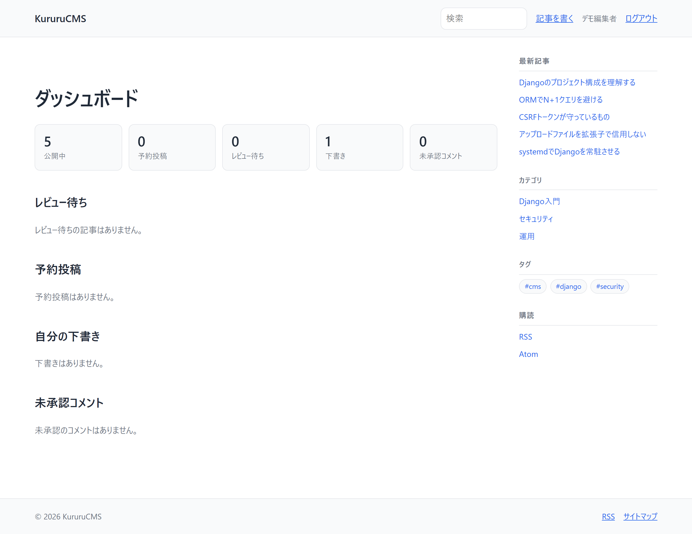
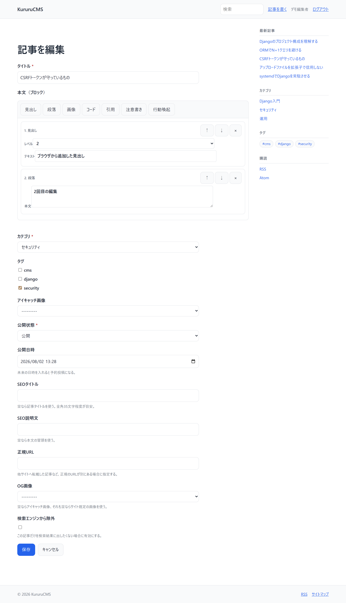

# 【7日目】Django で管理画面を自作――ダッシュボードとブロックエディター

> 連載「10日で作る Django CMS」の7日目です。
> 成果物: <https://github.com/kurumonn/DjangoCMS>（タグ `day-07`）

---

## 1. 今日の結論

編集者のための画面を作ります。

- ダッシュボード（記事数・レビュー待ち・予約投稿・未承認コメント・操作履歴）
- ブロックエディター（本文を「意味」の配列として持つ）
- 再利用ブロック
- 自動保存 API
- **同時編集の検出（楽観ロック）**

**今日いちばん大事なのは、本文を HTML 文字列として保存しないこと**です。
ブロックの配列にすると、投稿者に HTML を書かせずに済みます。

---

## 2. 今日の完成画面

ダッシュボードはこうなります。



ブロックエディターはこうです。



---

## 3. 今日変更するファイル

```text
dashboard/                 新規アプリ
├── views.py               ダッシュボード
├── api.py                 自動保存 API
└── urls.py
blog/
├── blocks.py              新規（ブロックの定義と検証）
├── models.py              変更（blocks / version / ReusableBlock）
├── forms.py               変更
├── templatetags/
│   └── block_tags.py      新規（ブロックの描画）
└── tests/test_blocks.py   新規
templates/
├── dashboard/index.html   新規
├── blog/blocks/*.html     新規（ブロック種別ごとに1枚）
└── blog/article_form.html 変更
static/js/block-editor.js  新規（依存パッケージなし）
```

---

## 4. 完成コード

### 4.1 ブロックのデータ構造

```python
# blog/blocks.py
"""ブロックエディターのデータ構造と検証。

本文を1つの巨大な HTML 文字列として保存すると、次の問題が起きる。

  * 投稿者が任意の HTML を書けるため、<script> を止めきれない
  * 「見出しだけ抜き出して目次を作る」といった加工ができない
  * デザインを変えるたびに、過去記事の HTML を一括置換することになる

そこで本文を「ブロックの配列」として持つ。
保存されるのは意味（見出し・段落・画像）であって、見た目ではない。
HTML はテンプレート側で組み立てるので、出力は常にこちらの管理下に入る。

    [
      {"type": "heading",   "data": {"level": 2, "text": "見出し"}},
      {"type": "paragraph", "data": {"text": "本文"}},
      {"type": "image",     "data": {"media_id": 15, "alt": "説明"}}
    ]
"""

# 1記事あたりのブロック数の上限。
# 上限が無いと、巨大な JSON を送りつけるだけでメモリと描画時間を奪える。
MAX_BLOCKS = 300
MAX_TEXT_LENGTH = 20_000


def _validate_heading(data: dict) -> dict:
    level = data.get("level", 2)
    if level not in (2, 3, 4):
        # h1 は記事タイトルが使う。見出しレベルを飛ばさせないため h2〜h4 に限る。
        raise ValidationError("見出しレベルは 2〜4 で指定してください。")
    return {"level": int(level), "text": _text(data)}


def _validate_cta(data: dict) -> dict:
    url = _text(data, "url")
    # javascript: や data: を弾く。リンク先は http(s) と相対パスだけ許可する。
    if not (url.startswith(("https://", "http://", "/"))):
        raise ValidationError("リンク先は http(s) か / で始まるパスにしてください。")
    return {"text": _text(data), "url": url}


def validate_blocks(value) -> list[dict]:
    """ブロック配列を検証し、正規化したものを返す。

    未知の種類はエラーにする。黙って無視すると、
    「保存できたのに表示されない」という分かりにくい状態になる。
    """
    if value in (None, ""):
        return []
    if not isinstance(value, list):
        raise ValidationError("ブロックは配列で指定してください。")
    if len(value) > MAX_BLOCKS:
        raise ValidationError(f"ブロック数が多すぎます（上限 {MAX_BLOCKS}）。")

    normalized = []
    for index, block in enumerate(value, start=1):
        spec = BLOCK_TYPES.get(block.get("type"))
        if spec is None:
            raise ValidationError(
                f"{index} 番目: 未知のブロック種別「{block.get('type')}」です。"
            )
        try:
            normalized.append({"type": spec.name, "data": spec.validate(block["data"])})
        except ValidationError as exc:
            raise ValidationError(
                f"{index} 番目（{spec.label}）: {exc.messages[0]}"
            ) from exc

    return normalized
```

### 4.2 本文を平文で写しておく

```python
# blog/models.py（抜粋）
    body = models.TextField(
        "本文", blank=True, default="",
        help_text="ブロックエディターを使う場合は自動で埋まる。"
                  "検索と抜粋はこの欄を対象にする。",
    )
    blocks = models.JSONField(
        "本文ブロック", default=list, blank=True, validators=[validate_blocks],
    )

    def save(self, *args, **kwargs):
        ...
        # ブロックを使っている記事は、body を平文の写しとして保つ。
        # こうしておくと、検索・抜粋・RSS が JSON を解釈しなくて済む。
        # 「JSON をそのまま LIKE 検索する」実装にすると、
        # "heading" や "media_id" といったキー名にヒットしてしまう。
        if self.blocks:
            mirrored = blocks_to_plain_text(self.blocks)
            if mirrored != self.body:
                self.body = mirrored
                self._add_update_field(kwargs, "body")
        ...
```

### 4.3 版番号（楽観ロック）

```python
    # 保存のたびに1つ増える。同時編集の検出（楽観ロック）に使う。
    #
    # updated_at で代用しないのは、時刻の比較が思ったより当てにならないため。
    #   * MySQL は既定でマイクロ秒を切り捨てる
    #   * JSON とテンプレートを往復する間に精度が落ちることがある
    #   * 丸め差を吸収しようと「1秒の許容」を入れると、
    #     同じ秒に起きた同時編集を素通ししてしまう
    # 整数の比較なら、こうした曖昧さが一切ない。
    version = models.PositiveIntegerField("版番号", default=0, editable=False)

    def save(self, *args, **kwargs):
        ...
        # 保存のたびに版番号を進める。
        self.version = (self.version or 0) + 1
        self._add_update_field(kwargs, "version")
        super().save(*args, **kwargs)

    @staticmethod
    def _add_update_field(kwargs: dict, name: str) -> None:
        """update_fields を指定した保存でも、内部で変えた列を書き戻す。

        update_fields に入れ忘れると、値がメモリ上だけ変わって
        データベースへ反映されない。原因が非常に見えにくい不具合になる。
        """
        update_fields = kwargs.get("update_fields")
        if update_fields is not None and name not in update_fields:
            kwargs["update_fields"] = list(update_fields) + [name]
```

### 4.4 ブロックの描画

**HTML はテンプレート側だけが持ちます。**

```python
# blog/templatetags/block_tags.py（抜粋）
"""ブロックを HTML へ描画するテンプレートタグ。

描画の方針:

  * ブロックの種類ごとにテンプレートを1つ用意する
  * 値は必ず Django のエスケープを通す（|safe を一切使わない）
  * 未知の種類は描画しない（保存時に弾いているが、二重に守る）

「投稿者が書いた HTML をそのまま出す」構造を作らないことが要点。
出力する HTML はすべてこちらのテンプレートに書かれているので、
投稿内容がどれだけ汚染されていてもタグとしては解釈されない。
"""

TEMPLATES = {
    "heading": "blog/blocks/heading.html",
    "paragraph": "blog/blocks/paragraph.html",
    "image": "blog/blocks/image.html",
    ...
}

# 再利用ブロックの入れ子は1段までにする。
# 制限しないと、互いを参照し合う2つの再利用ブロックで無限ループになる。
MAX_REUSABLE_DEPTH = 1


@register.simple_tag(takes_context=True)
def render_blocks(context, blocks, _depth: int = 0):
    """ブロックの配列を HTML へ変換する。"""
    if not blocks:
        return ""

    # 参照されるオブジェクトをまとめて引く（ブロックごとに引くと N+1 になる）。
    media_map = _load_media(blocks)
    article_map = _load_articles(blocks)
    reusable_map = _load_reusables(blocks) if _depth < MAX_REUSABLE_DEPTH else {}
    ...
```

```django
{# templates/blog/blocks/heading.html #}
{# 見出し。level は 2〜4 に検証済み。 #}
<h2 class="block-heading">{{ data.text }}</h2>
<h3 class="block-heading">{{ data.text }}</h3>
<h4 class="block-heading">{{ data.text }}</h4>
```

```django
{# templates/blog/blocks/code.html #}
{# コード。言語名は英数字とハイフンに検証済みなのでクラス名に使える。 #}
<pre class="block-code"><code class="language-{{ data.language }}">{{ data.code }}</code></pre>
```

### 4.5 自動保存 API

防御を6段重ねています。

```python
# dashboard/api.py（抜粋）
class ArticleAutosaveView(View):
    """記事の自動保存。

    ブラウザーの JavaScript から数秒おきに呼ばれる。
    「ログイン中の利用者が、自分の記事を繰り返し書き換える」入口なので、
    次を1つずつ確認する。

      1. ログインしているか
      2. CSRF トークンが正しいか（Django のミドルウェアが担当）
      3. その記事を編集してよいか
      4. 送られてきた JSON が壊れていないか、大きすぎないか
      5. ブロックの中身が妥当か
      6. 他の人が先に保存していないか（楽観ロック）

    どれか1つでも欠けると、そこが穴になる。
    """

    MAX_BODY_BYTES = 512 * 1024        # 512 KiB
    RATE_LIMIT = 12                    # 1分あたりの回数
    RATE_WINDOW_SECONDS = 60

    def post(self, request, pk):
        # --- 1. 認証 ---
        if not request.user.is_authenticated:
            # HTML のログイン画面ではなく JSON を返す。
            # 呼び出し側は JavaScript なので、HTML を返されても解釈できない。
            return _error("ログインが必要です。", 403)

        # --- 4. サイズ ---
        if len(request.body) > self.MAX_BODY_BYTES:
            return _error("送信されたデータが大きすぎます。", 413)

        ...

        # --- 6. 競合の検出 ---
        # 編集画面を開いた時点の版番号を送ってもらい、
        # サーバー側の版番号と食い違っていたら保存を断る。
        client_version = payload.get("version")
        if not isinstance(client_version, int):
            return _error("version を送ってください。", 400)
        if client_version != article.version:
            return _error(
                "他の場所でこの記事が更新されています。"
                "ページを再読み込みしてから編集してください。",
                409, server_version=article.version,
            )
```

### 4.6 エディター（依存パッケージなし）

```javascript
/*
 * ブロックエディター（依存パッケージなし）。
 *
 * 方針:
 *   - HTTP は fetch のみ。外部ライブラリを増やさない。
 *   - DOM は createElement と textContent で組み立てる。
 *     innerHTML に利用者の入力を渡すと、その時点で XSS の口になる。
 *   - 送るのは「意味」だけ（見出し・段落・画像）。HTML は送らない。
 */

function makeButton(label, title, handler) {
  var button = document.createElement("button");
  button.type = "button";   // form の中なので type を明示しないと送信される
  button.className = "btn";
  button.textContent = label;
  button.addEventListener("click", handler);
  return button;
}

function autosave() {
  fetch(autosaveUrl, {
    method: "POST",
    credentials: "same-origin",
    headers: {
      "Content-Type": "application/json",
      "X-CSRFToken": getCookie("csrftoken"),
    },
    body: JSON.stringify({ title: ..., blocks: blocks, version: version })
  })
    .then(...)
    .then(function (result) {
      if (result.body && result.body.ok) {
        // サーバーが返した版番号を控える。
        // ここを更新し忘れると、2回目の自動保存が必ず 409 になる。
        version = result.body.version;
        setStatus("自動保存しました（" + new Date().toLocaleTimeString() + "）", "saved");
      }
    });
}
```

---

## 5. コードの意味

### `JSONField`

```python
blocks = models.JSONField("本文ブロック", default=list, blank=True,
                          validators=[validate_blocks])
```

| 部分 | 意味 |
| --- | --- |
| `JSONField` | Python の `list` / `dict` をそのまま保存できるフィールド |
| `default=list` | 既定値は空リスト。`default=[]` と書いてはいけない |
| `validators=[...]` | `full_clean()` 時に呼ばれる検証関数 |

`default=[]` と書くと、**すべてのインスタンスが同じリストを共有します**。
Python のミュータブルなデフォルト引数と同じ問題です。
必ず `default=list`（呼び出し可能オブジェクト）を渡します。

### `simple_tag` と `takes_context`

```python
@register.simple_tag(takes_context=True)
def render_blocks(context, blocks, _depth: int = 0):
```

| 部分 | 意味 |
| --- | --- |
| `simple_tag` | 値を返すテンプレートタグを作る |
| `takes_context=True` | 第1引数にテンプレートのコンテキストが渡る |

テンプレートからはこう呼びます。

```django

```

### `mark_safe` を使ってよい範囲

```python
# 各テンプレートの出力はエスケープ済み。連結だけを安全とみなす。
return mark_safe("".join(parts))
```

`parts` の各要素は `render_to_string()` の結果で、
その中の `{{ data.text }}` は Django が自動でエスケープしています。

**エスケープ済みの文字列を連結した結果** だけを安全とみなしています。
生の入力に `mark_safe` を使っているわけではありません。

### `type="button"` を明示する

```javascript
button.type = "button";
```

HTML の `<button>` は、`type` を省略すると `type="submit"` になります。
フォームの中に置いた「ブロックを追加」ボタンは、押した瞬間に送信されます。

---

## 6. 内部で起きていること

### なぜ HTML を保存しないのか

```text
【HTML を保存する場合】
投稿者が入力  →  <p>本文</p><script>...</script>
                        ↓ そのまま保存
                        ↓ |safe で出力
                  スクリプトが実行される

【ブロックを保存する場合】
投稿者が入力  →  {"type": "paragraph", "data": {"text": "<script>..."}}
                        ↓ 検証して保存
                        ↓ paragraph.html が {{ data.text }} で出力
                  &lt;script&gt; と表示される（実行されない）
```

**出力する HTML が、すべてこちらのテンプレートにある**のが要点です。

副次的な利点もあります。

- 見出しブロックだけを集めれば目次が作れる
- デザインを変えるとき、テンプレートを直すだけで過去記事にも反映される
- 「画像ブロックの alt が空の記事」を検索できる

### `body` を残す理由

```python
if self.blocks:
    mirrored = blocks_to_plain_text(self.blocks)
```

ブロックを JSON のまま検索すると、こうなります。

```sql
WHERE blocks LIKE '%paragraph%'
```

キー名の `"paragraph"` にヒットします。
`body` へ平文を写しておけば、検索・抜粋・RSS が JSON を知らなくて済みます。

テストで固定しています。

```python
def test_search_does_not_match_json_keys(self):
    article.blocks = [{"type": "paragraph", "data": {"text": "普通の本文"}}]
    article.save()
    # "paragraph" は JSON のキーの値だが、本文には含まれない。
    self.assertNotIn(article, Article.objects.published().search("paragraph"))
```

### 楽観ロックの仕組み

```text
利用者A                    サーバー                   利用者B
  version=5 で編集画面を開く   version=5
                              ← version=5 で保存 ──── 利用者B
                              version=6 になる
  version=5 で保存 →
                              5 ≠ 6 なので 409 を返す
  「他の場所で更新されています」
```

**なぜ時刻ではなく整数なのか。**
最初は `updated_at` を比較していましたが、
丸め誤差を吸収するために「1秒の許容」を入れていました。

```python
# 問題のあったコード
if (article.updated_at - client_updated_at).total_seconds() > 1:
    return _error(..., 409)
```

しかし **同時編集はまさにその1秒以内に起きます**。
2人が同じ記事を開いていれば、自動保存はほぼ同じタイミングで飛びます。

誤検知を防ぐために入れた許容が、
検出したかった事象そのものを検出できなくしていました。

整数の比較には、精度も丸めもタイムゾーンもありません。
**「1つでも違えば競合」と言い切れます。**

---

## 7. コマンドの説明

### `python manage.py makemigrations blog`

`version` 列を追加するとき、既存の行には `default=0` が入ります。

```text
Migrations for 'blog':
  blog/migrations/0006_article_version.py
    + Add field version to article
```

### 自動保存 API を手で叩く

```bash
curl -i -X POST http://127.0.0.1:8000/dashboard/api/articles/1/autosave/ \
  -H "Content-Type: application/json" \
  -d '{"title":"テスト","blocks":[],"version":0}'
```

ログインしていないので 403 が返れば正常です。

```text
HTTP/1.1 403 Forbidden
Content-Type: application/json
{"ok": false, "error": "ログインが必要です。"}
```

**HTML ではなく JSON が返ることを確認してください。**
JavaScript から呼ばれる口が HTML のログイン画面を返すと、
呼び出し側でパースエラーになります。

---

## 8. よくあるエラー

記録は [`docs/errors/day-07.md`](../errors/day-07.md) にあります。

### 8.1 楽観ロックの「1秒の許容」が同時編集を見逃す

```text
FAIL: test_stale_updated_at_is_rejected
AssertionError: 200 != 409
```

**原因と対処**: 「6. 内部で起きていること」を参照してください。

**ここで学べること**: 「安全側に倒すつもりで入れた例外」が、
守りたかったものをちょうど守れなくすることがあります。

許容値を入れたくなったら、
**その許容の中に、検出したい事象が入ってしまわないか** を確認してください。

### 8.2 `update_fields` を指定した保存で、内部で変えた列が保存されない

**症状**: 版番号を増やすコードを書いたのに、データベースの `version` が 0 のまま。

**原因**: `update_fields` を指定すると、Django は **そこに挙げた列だけ** を UPDATE します。
`save()` の中で `self.version` を変えても、一覧に入っていなければ
SQL に含まれず、メモリ上だけ変わって消えます。

**この不具合が厄介なところ**:

- 例外が出ない
- `article.version` を直後に読むと、増えた値が返る（メモリ上は変わっている）
- データベースを見に行くと 0 のまま

**対処**: 内部で変えた列を `update_fields` へ足すヘルパーを用意します。
「4.3」のコードを参照してください。

確認するときは `refresh_from_db()` を挟んでください。
挟まないと、メモリ上の値を見て「保存できている」と勘違いします。

### 8.3 テスト用ユーザーと実運用のグループで権限が食い違う

```text
KeyError: 'pending_comments'
```

**原因**: テスト用の `create_editor()` は blog の権限しか付けていませんでしたが、
実運用の `setup_groups` の「編集者」には `comments.change_comment` が入っていました。

**なぜ危ないか**:

| 食い違い | 起きること |
| --- | --- |
| テストの権限が **少ない** | 今回のように、テストだけが落ちる（気づける） |
| テストの権限が **多い** | テストは通るのに、実運用で権限不足になる（気づけない） |

後者が本当に怖い方です。
**テストのユーザー定義と、実際に配る権限は、同じ場所から作るべき**でした。

### 8.4 ブロック追加ボタンを押すとフォームが送信される

**原因**: `<button>` は `type` を省略すると `type="submit"` になります。

**対処**: `type="button"` を明示します。
JavaScript で動的に作るボタンも同じです。

### 8.5 未知のブロック種別を無視してはいけない

無視すると「保存は成功したのに、開くと消えている」状態になります。
利用者から見ると、書いた内容が黙って失われたことになります。

エラーメッセージには **何番目のブロックか** を入れます。
「ブロックが不正です」だけでは、30個あるうちのどれが悪いのか分かりません。

### 8.6 `javascript:` で始まるリンクを保存させない

テンプレート側の `{{ data.url }}` はエスケープされますが、
`href="javascript:..."` は **エスケープしても動きます**。

エスケープは「HTML の構造を壊さない」ための処理であって、
「URL スキームの安全性」は別の話です。保存時にスキームを制限します。

---

## 9. 動作確認

### ダッシュボード

- [ ] `/dashboard/` にログインなしでアクセスすると、ログイン画面へ飛ぶ
- [ ] 公開中・予約投稿・レビュー待ち・下書きの件数が正しい
- [ ] 投稿者には自分のレビュー依頼だけが見える
- [ ] 編集者には全員のレビュー依頼が見える
- [ ] コメント管理の権限が無い人には、コメント欄が表示されない

### ブロックエディター

- [ ] 「見出し」「段落」ボタンでブロックが増える
- [ ] ボタンを押してもフォームが送信されない
- [ ] ↑↓ で並び替えできる、× で削除できる
- [ ] 保存すると記事ページにブロックが描画される
- [ ] 段落に `<script>alert(1)</script>` と書いても、文字として表示される
- [ ] ブロックで書いた記事が検索でヒットする
- [ ] `paragraph` という語で検索してもヒットしない

### 自動保存

- [ ] 入力を止めて数秒待つと「自動保存しました（時刻）」と出る
- [ ] 続けてもう一度編集しても、2回目も成功する（409 にならない）
- [ ] 別のタブで同じ記事を保存してから元のタブで自動保存すると、409 になる
- [ ] ログアウト状態で API を叩くと、**JSON で** 403 が返る
- [ ] `curl` で CSRF トークン無しに叩くと 403
- [ ] 巨大な JSON を送ると 413
- [ ] 1分に13回叩くと 429
- [ ] 自動保存で `status` や `author` を送っても、変更されない

最後の項目は必ず試してください。
自動保存の口から公開状態を変えられると、承認フローが迂回されます。

---

## 10. セキュリティ上の注意

### 自動保存の口は「小さな管理画面」だと考える

自動保存 API は、ログイン中の利用者が
**繰り返し・自動的に・大量のデータを送れる** 入口です。
画面から呼ばれるからといって、検証を省略できません。

この CMS では6段の防御を置いています。

| 段 | 内容 | 抜けたときに起きること |
| --- | --- | --- |
| 1 | 認証 | 誰でも記事を書き換えられる |
| 2 | CSRF | 外部サイトから記事を書き換えられる |
| 3 | 権限 | 他人の記事を書き換えられる |
| 4 | サイズ | 巨大な JSON でメモリを奪われる |
| 5 | 内容検証 | 不正なブロックが保存される |
| 6 | 競合検出 | 他人の編集を黙って上書きする |

### 権限判定を API と画面で共有する

```python
# 画面側と同じ判定関数を使う。
# ここで独自の条件を書くと、画面では編集できるのに
# 自動保存だけ 403 になる、といった食い違いが起きる。
from blog.views import _can_edit

if not _can_edit(request.user, article):
    return _error("この記事を編集する権限がありません。", 403)
```

実際、この CMS では最初 API 側に別の条件を書いてしまい、
9日目に食い違いが表面化しました。

### 自動保存で変えてよい列を限定する

```python
article.title = title
article.blocks = blocks
article.save(update_fields=["title", "blocks", "body", "version", "updated_at"])
```

`status` や `author` を受け取らないことが重要です。
受け取ってしまうと、自動保存の JSON に `"status": "published"` を混ぜるだけで、
承認フローを通さずに公開できます。

テストで固定します。

```python
def test_autosave_does_not_change_publish_state(self):
    self._post(self._payload(status="published", published_at=...))
    self.article.refresh_from_db()
    self.assertEqual(self.article.status, Article.Status.DRAFT)
```

### `innerHTML` を使わない

```javascript
// 危険
card.innerHTML = "<span>" + block.data.text + "</span>";

// 安全
var span = document.createElement("span");
span.textContent = block.data.text;
card.appendChild(span);
```

サーバー側でエスケープしていても、
JavaScript が `innerHTML` へ入力を渡した時点で無効になります。

### 再利用ブロックの入れ子を制限する

```python
MAX_REUSABLE_DEPTH = 1
```

制限しないと、互いを参照し合う2つの再利用ブロックで無限ループになります。
記事を1つ開くだけでサーバーが停止します。

```python
def test_reusable_block_recursion_is_bounded(self):
    """再利用ブロックが互いを参照しても無限ループしない。"""
```

---

## 11. 今日の復習問題

**問1.** 本文を HTML 文字列ではなくブロックの配列で保存する利点を、
セキュリティと保守の両面から説明してください。

**問2.** 楽観ロックに `updated_at` ではなく整数の版番号を使う理由は何ですか。
「1秒の許容」がなぜ穴になるのかも答えてください。

**問3.** `save(update_fields=[...])` を使うとき、
`save()` の中で変更した列に起きる問題は何ですか。

**問4.** 自動保存 API が `status` を受け取ってはいけないのはなぜですか。

**問5.** サーバー側で HTML エスケープしていても、
JavaScript の `innerHTML` を使うと危険なのはなぜですか。

<details>
<summary>解答</summary>

**問1.**
セキュリティ面では、投稿者が任意の HTML を書けなくなります。
出力する HTML はすべてテンプレート側にあり、
ブロックの値は必ずエスケープされて埋め込まれます。
保守面では、見出しだけを抽出して目次を作るといった加工ができ、
デザイン変更もテンプレートの修正だけで過去記事へ反映されます。

**問2.**
時刻の比較は、MySQL のマイクロ秒切り捨てや
JSON との往復による精度低下で誤検知が起きます。
それを吸収するために「1秒の許容」を入れると、
同時編集はまさに1秒以内に起きるため、検出対象そのものを素通しします。
整数の比較には精度も丸めもなく、1つでも違えば競合と判定できます。

**問3.**
`update_fields` に挙げた列だけが UPDATE されるため、
`save()` の中で変更した列を一覧へ足し忘れると、
メモリ上だけ値が変わってデータベースへ反映されません。
例外も出ず、直後に属性を読むと変更後の値が返るため、非常に気づきにくくなります。

**問4.**
受け取ると、自動保存の JSON に `"status": "published"` を混ぜるだけで、
承認フローを通さずに記事を公開できてしまいます。
自動保存で変えてよい列（タイトルと本文）だけを明示的に更新します。

**問5.**
`innerHTML` に渡した文字列は HTML として解析されます。
サーバーがエスケープした値でも、JavaScript 側で
`&lt;` を戻したり、生の値を別経路で受け取ったりすれば実行されます。
`textContent` を使えば、文字列は必ず文字として扱われます。

</details>

---

## 12. Git の差分

```text
タグ    : day-07
コミット: day-07: ダッシュボードとブロックエディターを作る
```

```bash
git diff day-06 day-07
```

自動保存 API の防御だけを見る場合はこちらです。

```bash
git show day-07 -- dashboard/api.py
```

---

## 13. 次回予告

8日目は、認証を本格的なものに置き換えます。

- django-allauth の導入
- メールアドレスでのログイン
- メール確認（必須）
- **メールワンタイムコードでのログイン**
- Google・GitHub でのログイン
- レート制限とアカウント列挙対策

数字6桁のワンタイムコードは、それ単体では 100 万通りしかありません。
有効期限・試行回数・発行制限の3つが揃って初めて実用に耐える、という話をします。

次回 → [【8日目】django-allauth 完全入門](day-08.md)
