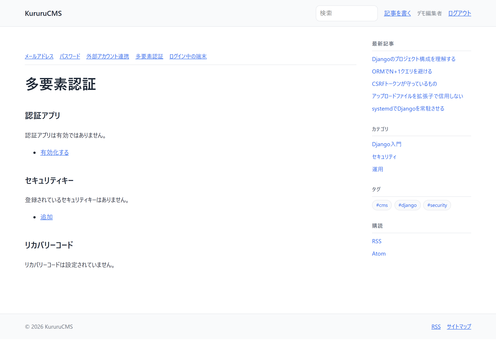
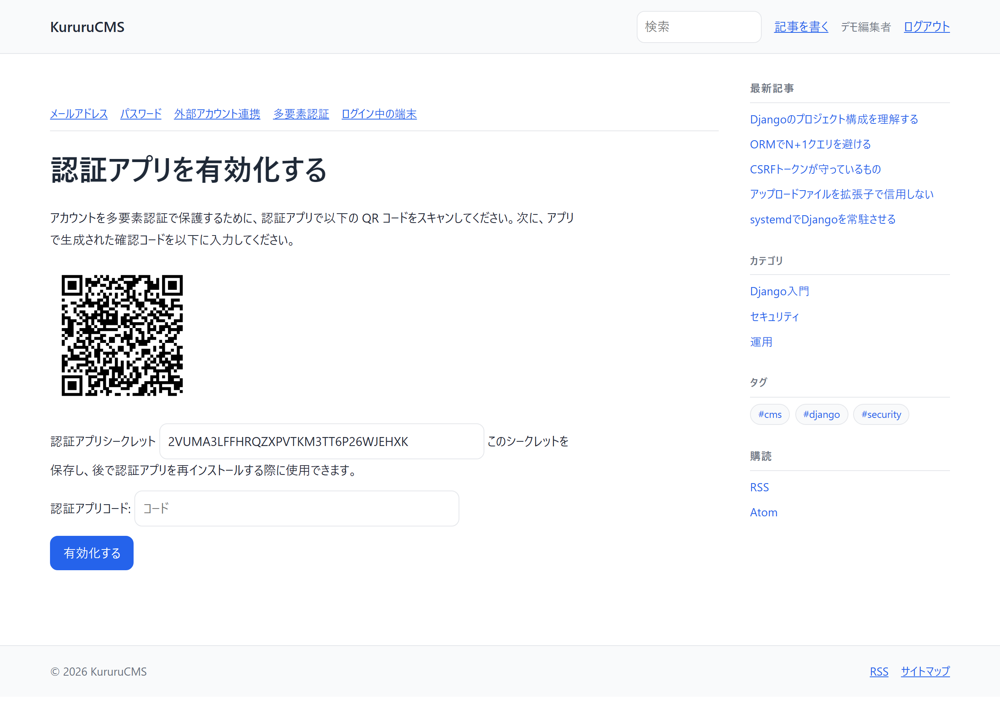

# 【9日目】Django でパスキー認証――TOTP・WebAuthn・復旧方法まで実装

> 連載「10日で作る Django CMS」の9日目です。
> 成果物: <https://github.com/kurumonn/DjangoCMS>（タグ `day-09`）

---

## 1. 今日の結論

パスワードに依存しない認証を足します。

- TOTP（認証アプリ）
- リカバリコード
- **パスキー（WebAuthn）**
- 管理者への多要素認証の必須化
- 本番で危険な設定を **起動時に** 検出するシステムチェック

**今日いちばん大事なのは、復旧手段を必ず用意すること**です。
認証を強くするほど、失ったときに戻れなくなります。

---

## 2. 今日の完成画面

多要素認証の一覧です。



TOTP の設定画面です。QR コードが出ます。



> このスクリーンショットに映っているシークレットは、
> 手元の SQLite にしか存在しないデモ用アカウントのものです。
> **本番の画面をそのまま記事へ載せないでください。**
> QR コードとシークレットは、それ単体で認証を突破できる情報です。

最終的な認証構成はこうなります。

```text
ログイン
├── パスワード
├── メールワンタイムコード
├── Google・GitHub
└── パスキー（単独でログイン可能）

追加認証（パスワードログインの後）
├── TOTP
└── パスキー

復旧
├── リカバリコード
├── 別の登録済みパスキー
└── 管理者による本人確認
```

---

## 3. 今日変更するファイル

```text
config/settings.py         変更（MFA の設定 / humanize）
accounts/
├── middleware.py          新規（管理者へのMFA必須化）
├── checks.py              新規（本番の危険設定を検出）
├── apps.py                変更（チェックを登録）
└── tests_mfa.py           新規
blog/
├── views.py               変更（編集者の権限を修正）
└── tests/factories.py     変更
dashboard/api.py           変更（権限判定を共有）
tools/capture_screenshots.py  新規（記事用スクショの自動撮影）
```

---

## 4. 完成コード

### 4.1 MFA の設定

```python
INSTALLED_APPS = [
    ...
    "allauth.usersessions",
    # 多要素認証（9日目）: TOTP / リカバリコード / パスキー
    "allauth.mfa",
    ...
]

# 3種類を有効にする。用途が違うので、どれか1つでは足りない。
#
#   totp           … スマートフォンの認証アプリ。端末を持っていれば使える。
#   recovery_codes … 認証アプリを失ったときの最後の手段。紙に印刷して保管する。
#   webauthn       … パスキー。端末の生体認証や物理キー。フィッシングに強い。
#
# recovery_codes を外すと、スマートフォンを失くした利用者が
# 二度とログインできなくなる。必ず入れる。
MFA_SUPPORTED_TYPES = ["totp", "recovery_codes", "webauthn"]

# パスキーだけでログインできるようにする（パスワード入力なし）。
MFA_PASSKEY_LOGIN_ENABLED = True
# 登録時のパスキー作成は無効のまま。
# 最初からパスキーだけで作らせると、その端末を失った時点で復旧手段が無くなる。
MFA_PASSKEY_SIGNUP_ENABLED = False

MFA_TOTP_ISSUER = os.environ.get("DJANGO_MFA_ISSUER", "KururuCMS")
MFA_TOTP_PERIOD = 30
MFA_TOTP_DIGITS = 6
# 時計のずれを吸収する幅（秒）。広げすぎると総当たりが楽になる。
MFA_TOTP_TOLERANCE = 30

MFA_RECOVERY_CODE_COUNT = 10
MFA_RECOVERY_CODE_DIGITS = 8
# リカバリコードは発行時に一度だけ見せる。
# 後からいつでも見られる状態にすると、画面を覗かれただけで突破される。
MFA_RECOVERY_CODES_SHOW_ONCE = True

# WebAuthn は HTTPS でしか動かない（localhost は例外扱い）。
#
# 「DEBUG と同じ値にしておけば安全」では不十分。
# DEBUG は環境変数の書き忘れで True のまま本番へ出ることがあり、
# そのとき WebAuthn の保護まで一緒に外れてしまう。
# 独立した環境変数にしたうえで、accounts/checks.py の
# システムチェックで「本番なのに有効」を検出する。
MFA_WEBAUTHN_ALLOW_INSECURE_ORIGIN = (
    os.environ.get("DJANGO_MFA_ALLOW_INSECURE_ORIGIN", "1" if DEBUG else "0") == "1"
)

# 管理画面へ入れる利用者には多要素認証を必須にする。
# 記事を書くだけの利用者にまで強制すると運用が回らないため、対象を絞る。
MFA_REQUIRED_FOR_STAFF = os.environ.get("DJANGO_MFA_REQUIRED_FOR_STAFF", "1") == "1"
```

### 4.2 管理者への必須化ミドルウェア

**詰まないように作ること**が要点です。

```python
# accounts/middleware.py（抜粋）
class StaffMfaRequiredMiddleware:
    """管理画面へ入れる利用者に、多要素認証の登録を求める。

    実装で気を付けること:

      * 設定画面そのものを塞がない（塞ぐと設定しに行けない）
      * ログアウトを塞がない（塞ぐと抜け出せない）
      * 再認証の画面を塞がない（設定画面の手前で止まる）
      * 静的ファイルを塞がない（CSS が当たらず画面が崩れる）

    1つでも通し忘れると、利用者が詰む。
    """

    EXEMPT_URL_NAMES = frozenset({
        "mfa_index",
        "mfa_activate_totp",
        "mfa_view_recovery_codes",
        "mfa_generate_recovery_codes",
        "mfa_download_recovery_codes",
        "mfa_list_webauthn",
        "mfa_add_webauthn",
        "mfa_reauthenticate",
        "mfa_authenticate",
        "account_logout",
        "account_reauthenticate",
        ...
    })

    def _has_mfa(self, user) -> bool:
        """日常的に使える認証手段を登録しているか。

        リカバリコードは「他の手段を失ったときの控え」であって、
        日常の認証手段ではない。これだけでは設定済みとみなさない。
        """
        from allauth.mfa.models import Authenticator

        return (
            Authenticator.objects.filter(user=user)
            .exclude(type=Authenticator.Type.RECOVERY_CODES)
            .exists()
        )
```

### 4.3 本番で危険な設定を検出するシステムチェック

```python
# accounts/checks.py（抜粋）
"""本番で危険になる設定を、起動時に検出する。

なぜテストではなくシステムチェックなのか。

    テスト          … 開発者が manage.py test を打ったときだけ実行される
    システムチェック … runserver でも migrate でも check --deploy でも必ず走る

「本番で危険な設定になっていないか」は、
実行し忘れようがない場所に置く。
"""

from django.conf import settings
from django.core.checks import Error, Warning, register


@register(deploy=True)
def check_mfa_settings(app_configs, **kwargs):
    """多要素認証まわりの設定を検査する。"""
    if settings.DEBUG:
        # 開発中は何も言わない。邪魔をしないことも要件のうち。
        return []

    issues = []

    if getattr(settings, "MFA_WEBAUTHN_ALLOW_INSECURE_ORIGIN", False):
        issues.append(Error(
            "MFA_WEBAUTHN_ALLOW_INSECURE_ORIGIN が本番で有効になっています。",
            hint="環境変数 DJANGO_MFA_ALLOW_INSECURE_ORIGIN=0 を設定してください。"
                 "有効なままだと、HTTPS でない経路でもパスキーの登録・認証を"
                 "受け付けてしまいます。",
            id="accounts.E001",
        ))

    if "recovery_codes" not in getattr(settings, "MFA_SUPPORTED_TYPES", []):
        issues.append(Warning(
            "リカバリコードが無効になっています。",
            hint="認証アプリやパスキーを失った利用者が、"
                 "二度とログインできなくなります。",
            id="accounts.W001",
        ))

    return issues
```

### 4.4 編集者の権限を直す

**9日目にスクリーンショットを撮ろうとして見つけた不具合です。**

```python
# blog/views.py
def _can_edit(user, article: Article) -> bool:
    """記事を編集・削除してよいか。

    「他人の記事も編集してよい人」の判定に is_staff だけを使わないこと。
    is_staff は「Django の管理画面へ入れる」という意味であって、
    「編集者である」という意味ではない。

    この CMS では、編集者ロールに blog.review_article を与えている。
    レビューして公開する役目である以上、本文を直せなければ仕事にならない。
    is_staff だけを見ていると、編集者が他人の記事を開いた瞬間に 403 になる。
    """
    if not user.is_authenticated:
        return False
    if user.is_staff:
        return True
    # 編集者（レビュー権限を持つ人）は、どの記事でも編集できる。
    if user.has_perm("blog.review_article"):
        return True
    return article.author_id == user.pk
```

### 4.5 スクリーンショットの自動撮影

```python
# tools/capture_screenshots.py（抜粋）
"""記事に載せるスクリーンショットを撮る。

なぜスクリプトにするか:

  * 手で撮ると、記事を書き直すたびに画面と食い違っていく
  * ウィンドウ幅や配色がばらつくと、記事の見た目がそろわない
  * 撮り直しが一発でできると、UI を直すことへの心理的な抵抗が減る
"""

        # ログイン前と後で、ブラウザーの状態（Cookie）を分ける。
        #
        # 1つのコンテキストで使い回すと、ログイン後に
        # /accounts/login/ を開いてもダッシュボードへリダイレクトされ、
        # 「ログイン画面のつもりがダッシュボードの写真」になる。
        # 実際にこれをやって、4枚が同じ画像になった。
        anon_context = new_context()
        auth_context = new_context()


def _warn_about_duplicates() -> None:
    """同じ内容の画像が複数ないか確かめる。

    リダイレクトで別のページを撮ってしまうと、
    ファイル名は違うのに中身が同じ画像ができる。
    見た目では気づきにくいので、ハッシュで検出する。
    """
```

---

## 5. コードの意味

### TOTP の仕組み

```text
【登録時】
サーバーが共有秘密鍵を生成
   ↓ QR コードで表示
スマートフォンの認証アプリが読み取って保存

【ログイン時】
アプリ側:    秘密鍵 + 現在時刻 → 6桁のコード
サーバー側:  秘密鍵 + 現在時刻 → 6桁のコード
             ↓
          一致すれば認証成功
```

**通信していません。** 両者が同じ計算を独立に行い、結果を突き合わせるだけです。
だから機内モードでも動きます。

計算式は次のとおりです。

```python
counter = int(time.time()) // 30        # 30秒ごとに1つ進む
code = HMAC-SHA1(secret, counter) の下位6桁
```

### `MFA_TOTP_TOLERANCE`

```python
MFA_TOTP_TOLERANCE = 30   # 秒
```

端末とサーバーの時計は完全には一致しません。
許容が 0 だと、数秒ずれただけでログインできなくなります。

ただし広げすぎると、**同時に有効なコードが増えます**。

```text
許容 30 秒  → 前後1個ずつ、合計3個のコードが有効
許容 300 秒 → 前後10個ずつ、合計21個のコードが有効（7倍通りやすい）
```

### `MFA_RECOVERY_CODES_SHOW_ONCE`

```python
MFA_RECOVERY_CODES_SHOW_ONCE = True
```

`False` にすると、ログイン中はいつでもリカバリコードを見られます。
一見便利ですが、**セッションを盗まれた時点で全コードが漏れます**。

`True` なら、発行時にしか表示されません。
控え忘れたら再発行（古いコードは無効）になります。

### パスキー（WebAuthn）の仕組み

```text
【登録時】
端末が鍵ペアを作る
   ├── 秘密鍵: 端末から出ない（Secure Enclave / TPM など）
   └── 公開鍵: サーバーへ送る

【ログイン時】
サーバー → チャレンジ（ランダムな値）を送る
端末     → 生体認証などで本人確認 → 秘密鍵で署名
サーバー → 公開鍵で署名を検証
```

**フィッシングに強い理由**がここにあります。

署名の対象には、**アクセスしているドメイン名が含まれます**。

```text
本物:   cms.example.com  → cms.example.com 向けの署名
偽物: cms-example.com    → cms-example.com 向けの署名
                            ↓
                     本物のサーバーでは検証に失敗する
```

利用者が偽サイトに騙されても、**署名が使い回せません**。
パスワードや TOTP のコードは、偽サイトへ入力すれば本物へ中継されてしまいます。

### `@register(deploy=True)`

```python
@register(deploy=True)
def check_mfa_settings(app_configs, **kwargs):
```

| 書き方 | 実行されるタイミング |
| --- | --- |
| `@register()` | `runserver` `migrate` `check` すべて |
| `@register(deploy=True)` | `check --deploy` のときだけ |

本番向けの検査は `deploy=True` にします。
開発中に毎回警告が出ると、無視する習慣がついてしまうためです。

---

## 6. 内部で起きていること

### 3種類の認証手段の役割分担

| 手段 | 強さ | 失いやすさ | 位置づけ |
| --- | --- | --- | --- |
| TOTP | 中 | 端末の紛失・機種変更 | 日常の2段目 |
| パスキー | 高（フィッシング耐性） | 端末の紛失 | 日常の1段目にもなれる |
| リカバリコード | 中 | 紙の紛失 | **最後の手段** |

**リカバリコードを日常の認証手段とみなさない**のが重要です。

```python
def _has_mfa(self, user) -> bool:
    """日常的に使える認証手段を登録しているか。

    リカバリコードは「他の手段を失ったときの控え」であって、
    日常の認証手段ではない。これだけでは設定済みとみなさない。
    """
    return (
        Authenticator.objects.filter(user=user)
        .exclude(type=Authenticator.Type.RECOVERY_CODES)
        .exists()
    )
```

リカバリコードだけを登録した状態を「設定済み」と認めると、
利用者は10枚の紙を毎回持ち歩くことになります。

### 必須化ミドルウェアで詰まないようにする

```text
【通し忘れた場合】
管理者がログイン
   ↓ ミドルウェアが mfa_index へリダイレクト
   ↓ mfa_index も塞いでいる
   ↓ また mfa_index へリダイレクト
   ↓ 無限ループ（ERR_TOO_MANY_REDIRECTS）
```

通すべきものは4種類あります。

| 通すべきもの | 通さないと |
| --- | --- |
| 多要素認証の設定画面 | 設定しに行けない（無限リダイレクト） |
| ログアウト | 抜け出せない |
| 再認証の画面 | 設定画面の手前で止まる |
| 静的ファイル | CSS が当たらず画面が崩れる |

テストで固定します。

```python
def test_staff_can_still_reach_mfa_setup(self):
    """設定ページ自体を塞ぐと、設定しに行けなくなる。"""

def test_staff_can_still_log_out(self):
    """ログアウトを塞ぐと詰む。"""
```

### なぜ `DEBUG` に紐づけないのか

最初はこう書いていました。

```python
# 開発中だけ緩め、本番では必ず False にする
MFA_WEBAUTHN_ALLOW_INSECURE_ORIGIN = DEBUG
```

問題が2つあります。

**問題1: DEBUG の書き忘れで保護まで一緒に外れる**

```python
DEBUG = os.environ.get("DJANGO_DEBUG", "1") == "1"   # 既定は True
```

本番で `DJANGO_DEBUG=0` を設定し忘れると、
`DEBUG=True` になるだけでなく、**WebAuthn の保護も同時に外れます**。
1つの設定ミスが2つの穴になります。

**問題2: テストで確かめられない**

Django のテストランナーは実行時に `settings.DEBUG` を `False` へ書き換えますが、
`MFA_WEBAUTHN_ALLOW_INSECURE_ORIGIN` は
**settings.py を読み込んだ時点**で計算済みなので `True` のまま残ります。

```text
AssertionError: True is not false
```

このテストは「本番が安全か」を確かめているつもりで、何も確かめていません。

**解決**: 独立した環境変数にし、システムチェックで検出します。

```bash
DJANGO_DEBUG=0 python manage.py check --deploy
```

```text
ERRORS:
?: (accounts.E002) メールの送信先がコンソールのままです。
	HINT: メール確認・ワンタイムコード・パスワード再設定が利用者へ届きません。
```

---

## 7. コマンドの説明

### `python manage.py migrate`

```text
Applying mfa.0001_initial... OK
Applying mfa.0002_authenticator_timestamps... OK
Applying mfa.0003_authenticator_type_uniq... OK
```

`mfa_authenticator` テーブルが作られます。
TOTP の秘密鍵、パスキーの公開鍵、リカバリコードがすべてここに入ります。

### `python manage.py check --deploy`

| 項目 | 内容 |
| --- | --- |
| 目的 | 本番向けの設定を検査する |
| 実行場所 | `manage.py` があるディレクトリ |
| 正常例 | `System check identified no issues` |
| 異常例 | `accounts.E001` `security.W004` など |
| 判断方法 | ERRORS が0件であること |

`DEBUG=False` の状態で実行しないと意味がありません。

```bash
DJANGO_DEBUG=0 DJANGO_SECRET_KEY=... python manage.py check --deploy
```

Windows の PowerShell では次のようにします。

```powershell
$env:DJANGO_DEBUG="0"; python manage.py check --deploy
```

### `python tools/capture_screenshots.py`

| 項目 | 内容 |
| --- | --- |
| 目的 | 記事用のスクリーンショットを撮り直す |
| 前提 | 開発サーバーが起動していること、playwright が入っていること |
| 正常例 | `11 枚を docs/images へ保存しました。` |
| 異常例 | `警告: 内容が同じ画像があります -> a.png, b.png` |
| 判断方法 | 重複の警告が出ないこと |

```bash
pip install playwright
```

```bash
python -m playwright install chromium
```

---

## 8. よくあるエラー

記録は [`docs/errors/day-09.md`](../errors/day-09.md) にあります。

### 8.1 `KeyError: 'humanize'` でパスキー一覧だけが落ちる

**原因**: allauth のパスキー一覧テンプレートが `naturaltime` フィルタを使います。
`django.contrib.humanize` を `INSTALLED_APPS` に入れていないと、
**その画面だけ** 500 になります。

**気づきにくい理由**: `manage.py check` は通ります。
テンプレートは描画時に初めて読まれるためです。

**対処**: `INSTALLED_APPS` に `"django.contrib.humanize"` を追加します。

### 8.2 `force_login()` では再認証が要る画面を開けない

```text
AssertionError: 302 != 200
```

**原因**: `ACCOUNT_REAUTHENTICATION_REQUIRED = True` にしているため、
認証手段を追加・削除する画面は **直前にパスワードを入力したこと** を求めます。
`force_login()` はセッションへユーザーを入れるだけで、
「いつ本人確認したか」を記録しません。

**これはバグではなく、意図した動作です。**
セッションを盗まれても、パスワードを知らなければ
攻撃者が自分のパスキーを勝手に追加できない——という保護です。

**対処**: テストでも実際にパスワードを入力してログインします。
そして「再認証を求めること」自体もテストにします。

### 8.3 レート制限がテスト間で持ち越されて 429 になる

**原因**: allauth のログイン試行回数はキャッシュに記録されます。
Django のテストはデータベースをロールバックしますが、**キャッシュは戻しません**。

6日目の「サイトマップがテスト間で汚染される」問題と、原因はまったく同じです。

**対処**: `setUp()` で `cache.clear()` します。

### 8.4 編集者が他人の記事を編集できない（スクリーンショットで発見）

```text
403 Forbidden
```

**テストは 252 件すべて通っていました。**

**原因**: `_can_edit()` が `is_staff` しか見ていませんでした。
`is_staff` は「Django の管理画面へ入れる」という意味であって、
「編集者である」という意味ではありません。**この2つを混同していました。**

**なぜテストで気づけなかったか**: テストの `create_staff()` は
`is_staff=True` を付けていましたが、
**実運用の「編集者」グループには is_staff が付いていません**。
テスト用のユーザーと、実際に配る役割が食い違っていました。

**対処**: 「4.4」を参照してください。
自動保存 API も、独自の条件を書かずに同じ関数を使うよう直しました。

### 8.5 多要素認証を必須にしたら、既存のテストが3件落ちた

```text
FAIL: test_staff_can_preview_any_draft      AssertionError: 302 != 200
FAIL: test_staff_can_edit_others_article    AssertionError: 302 != 200
FAIL: test_staff_can_autosave_others_article AssertionError: 302 != 200
```

5日目にも同じことが起きています（公開権限を分離したら3日目のテストが落ちた）。
**バグではなく仕様変更** なので、直すのはテストの側です。

**対処**: テスト用のスタッフも、実運用と同じ「多要素認証を登録済み」にそろえます。

### 8.6 ログイン済みでログイン画面を撮ると、ダッシュボードが撮れる

スクリーンショットの4枚が **バイト単位で同一** になりました。

**原因**: 撮影スクリプトが最初にログインしてから全ページを回っていたため、
`/accounts/login/` が `/dashboard/` へリダイレクトされていました。

**対処**: 匿名用と認証済み用でブラウザーのコンテキストを分け、
撮影後にハッシュで重複を検出します。

---

## 9. 動作確認

### TOTP

- [ ] `/accounts/2fa/` が開く
- [ ] `/accounts/2fa/totp/activate/` で QR コードが出る
- [ ] `force_login` 相当（セッションだけ）では、設定画面が再認証へ飛ぶ
- [ ] 認証アプリで読み取り、表示されたコードで有効化できる
- [ ] ログアウトして再ログインすると、パスワードの後にコードを求められる
- [ ] 間違ったコードではログインが完了しない

### リカバリコード

- [ ] 10個のコードが発行される
- [ ] 一度表示したあと、同じ画面をもう一度開いても見られない
- [ ] リカバリコードでログインできる
- [ ] **同じコードは2回使えない**

### パスキー

- [ ] `/accounts/2fa/webauthn/` が 500 にならない（`humanize` が入っている）
- [ ] パスキーを登録できる（HTTPS か localhost が必要）
- [ ] パスキーだけでログインできる
- [ ] 複数のパスキーを登録できる
- [ ] パスキーを削除するとき、再認証を求められる

### 管理者の必須化

- [ ] `is_staff` のユーザーで、MFA 未登録だと `/accounts/2fa/` へ飛ばされる
- [ ] その状態でも設定画面・ログアウト・静的ファイルには到達できる
- [ ] リカバリコードだけ登録した状態では、まだ飛ばされる
- [ ] TOTP を登録すると、通常のページへ進める
- [ ] `is_staff` でないユーザーは影響を受けない

### システムチェック

```bash
DJANGO_DEBUG=0 DJANGO_SECRET_KEY=dummy python manage.py check --deploy
```

- [ ] `MFA_WEBAUTHN_ALLOW_INSECURE_ORIGIN=1` のとき `accounts.E001` が出る
- [ ] `EMAIL_BACKEND` がコンソールのとき `accounts.E002` が出る
- [ ] `DEBUG=True` のときは何も出ない

---

## 10. セキュリティ上の注意

### 復旧手段を必ず用意する

認証を強くするほど、失ったときに戻れなくなります。

```text
【パスキーだけの構成】
スマートフォンを水没させる
   ↓ パスキーは端末から出ない設計なので、他の端末では使えない
   ↓ 二度とログインできない
```

この CMS では3層にしています。

1. 日常: パスキー / TOTP
2. 控え: リカバリコード（紙）
3. 最終: 管理者による本人確認

`MFA_PASSKEY_SIGNUP_ENABLED = False` にしているのも同じ理由です。
最初からパスキーだけでアカウントを作らせると、控えを取る機会がありません。

### リカバリコードは一度だけ表示する

```python
MFA_RECOVERY_CODES_SHOW_ONCE = True
```

いつでも見られる状態は、
「セッションを盗まれた時点で全コードが漏れる」ことを意味します。

### 認証手段の追加・削除に再認証を要求する

```python
ACCOUNT_REAUTHENTICATION_REQUIRED = True
```

これが無いと、こうなります。

```text
攻撃者がセッションを盗む
   ↓ パスキー追加画面を開く
   ↓ 自分の端末のパスキーを登録
   ↓ 以後、正規のログイン手段として使える（セッションが切れても入れる）
```

**一時的な侵入が、永続的な侵入に変わります。**

### WebAuthn は HTTPS が前提

```python
MFA_WEBAUTHN_ALLOW_INSECURE_ORIGIN = ...
```

ブラウザーは、HTTPS（と localhost）以外で WebAuthn API を提供しません。
この設定を本番で有効にすると、その保護が外れます。

**「テストで確かめる」だけでは不十分です。**
テストは実行しなければ動きません。
システムチェックなら、`migrate` のたびに必ず走ります。

### 管理者だけを必須化の対象にする

```python
MFA_REQUIRED_FOR_STAFF = True
```

全員に強制すると、次のことが起きます。

- 記事を1本書くだけの人が設定でつまずく
- 「面倒だから」と共有アカウントが生まれる
- サポート対応の負荷が増える

**被害が大きい権限を持つ人から順に必須化する**のが現実的です。

### スクリーンショットに秘密を写さない

この記事の TOTP 設定画面には、シークレットと QR コードが写っています。
手元の SQLite にしか存在しないデモ用アカウントのものです。

**本番の画面をそのまま記事へ載せないでください。**
QR コードは、それだけで認証アプリに登録できてしまいます。

---

## 11. 今日の復習問題

**問1.** TOTP は、サーバーと端末がどうやって同じコードを出しますか。
通信していないのはなぜ問題にならないのですか。

**問2.** パスキー（WebAuthn）がフィッシングに強い理由を説明してください。
パスワードや TOTP が弱い理由も答えてください。

**問3.** リカバリコードだけを登録した状態を「多要素認証を設定済み」と
みなしてはいけないのはなぜですか。

**問4.** 管理者への多要素認証を必須にするミドルウェアで、
通しておかなければならない URL を4種類挙げてください。

**問5.** 危険な設定の検出を、テストではなくシステムチェックに置く理由は何ですか。

<details>
<summary>解答</summary>

**問1.**
登録時に共有した秘密鍵と、現在時刻（30秒単位のカウンター）から、
両者が独立に HMAC-SHA1 を計算して同じ6桁を得ます。
計算に必要なのは秘密鍵と時刻だけなので、通信は不要です。
そのため機内モードでも動きます。

**問2.**
WebAuthn の署名には、アクセスしているドメイン名が含まれます。
偽サイトで署名を作らせても、その署名は偽サイト向けなので
本物のサーバーでは検証に失敗します。
パスワードや TOTP のコードは、偽サイトへ入力された値を
そのまま本物のサーバーへ中継できてしまいます。

**問3.**
リカバリコードは「他の手段を失ったときの控え」であり、
日常的に使う認証手段ではないためです。
これだけを認めると、利用者は10枚の紙を毎回持ち歩くことになります。

**問4.**
多要素認証の設定画面、ログアウト、再認証の画面、静的ファイルの4種類です。
設定画面を塞ぐと無限リダイレクトになり、
ログアウトを塞ぐと抜け出せず、
再認証を塞ぐと設定画面の手前で止まり、
静的ファイルを塞ぐと CSS が当たらず画面が崩れます。

**問5.**
テストは開発者が実行したときだけ動きますが、
システムチェックは `runserver` `migrate` `check --deploy` のたびに必ず走ります。
「本番で危険な設定になっていないか」は、
実行し忘れようがない場所に置くべきです。

</details>

---

## 12. Git の差分

```text
タグ    : day-09
コミット: day-09: TOTP・リカバリコード・パスキー(WebAuthn)を実装
```

```bash
git diff day-08 day-09
```

必須化ミドルウェアとシステムチェックだけを見る場合はこちらです。

```bash
git show day-09 -- accounts/middleware.py accounts/checks.py
```

テストは 252 件になりました。

```bash
python manage.py test
```

---

## 13. 次回予告

10日目は、本番へ出せる状態に仕上げます。

- PostgreSQL への移行
- Redis（レート制限を共有キャッシュにする）
- Docker Compose
- 設定ファイルの分割（`base` / `local` / `production`）
- `SECURE_*` と HSTS
- バックアップと復元テスト

そのあと第2部として、**Linux・Nginx・秘密鍵・Let's Encrypt** の
デプロイ編（10日間）へ続きます。

次回 → 【10日目】Django CMS 完成――テスト・Docker・セキュリティ・本番公開
